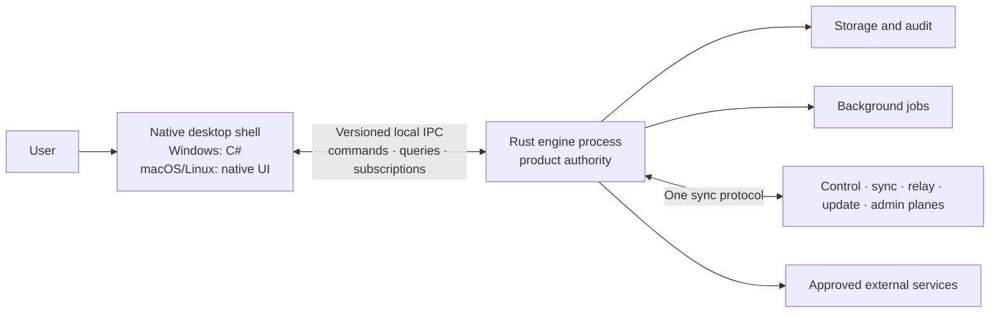

# Target Architecture

## Purpose and status

This document defines the target architecture for the Eitmad desktop system. It establishes authority and trust boundaries before production implementation begins. It is normative: implementations MUST conform to it or record an approved architectural decision explaining a deliberate exception.

## System shape

The product is a family of native desktop applications backed by a Rust engine. The engine is a separate process and is the sole authority for product behavior and state. Each platform shell presents native UI and delegates all authoritative work through typed local IPC.

The same Rust engine MUST support:

- interactive operation behind a native shell;
- headless operation for supported unattended workflows;
- diagnostic operation for health checks, compatibility inspection, and support tooling.

Implemented authority foundations now include protocol `1.2`, a runtime-owned SQLite database, organization configuration with `ar-YE` default, direct scoped ReBAC policy v1, durable audit/idempotency, and active subscription reauthorization. Native settings UI, trusted production identity provisioning, database encryption, and the first production business vertical remain future work.

## Ownership rules

Ownership means responsibility for defining, validating, executing, persisting, and testing authoritative behavior. A platform shell MAY render or temporarily stage presentation state, but it MUST NOT become an alternative authority.

| Concern | Rust engine | Native shell / platform adapter |
| --- | --- | --- |
| Domain rules and validation | Owns | Displays results and validation errors |
| Contracts and schema definitions | Owns canonical definitions | Consumes generated or validated bindings |
| Authorization and permissions | Authorizes every operation | Requests operations; adapts platform identity prompts |
| Database and migrations | Owns | No direct access |
| Configuration | Owns parsing, validation, and persistence | Presents settings UI from engine capabilities |
| Sync and conflict handling | Owns | Displays state and user-resolvable conflicts |
| Audit history | Owns creation and storage | Presents read models |
| Updates | Owns policy, compatibility, rollout, and state | Performs native installation steps |
| External APIs and secrets | Owns access and secret use | No direct calls or secret storage |
| Background jobs | Owns scheduling and execution | Integrates platform lifecycle signals only |
| Native UI and accessibility | Supplies semantic product state | Owns rendering and platform-native interaction |
| OS integration | Defines requested capability | Owns notifications, file pickers, protocol hooks, and installer APIs |
| Localization content | Owns product/domain messages and stable message identifiers | Owns platform chrome and correct rendering |
| Telemetry and diagnostics | Owns structured policy and redaction | Captures approved shell health signals only |

When ownership is unclear, the default is the Rust engine. Any exception MUST be narrow, documented, and incapable of changing authoritative product state independently.

## Rust authority

Rust MUST own:

- domain entities, workflows, invariants, and validation;
- commands, queries, subscriptions, events, errors, versions, and capabilities;
- config, identity, permissions, relationship-based authorization, and scopes;
- database access, migrations, transactions, audit, and history-critical event streams;
- synchronization, conflict policy, connectivity state, and retry behavior;
- update eligibility, compatibility, rollout, migration safety, and update state;
- approved external-service integrations, credentials, and secret handling;
- observability rules, redaction, background jobs, and diagnostic behavior.

The engine MUST remain useful without a GUI. Its public boundaries MUST be deterministic enough to test independently from every shell.

## Process model

### Lifecycle

The lifecycle foundation is implemented in `eitmad-engine-runtime` and its [canonical subsystem guide](../developer/subsystems/engine-runtime.md). It exposes typed process identity, `Starting → Ready → Stopping → Stopped` transitions, terminal failure, readiness-aware health checks, bounded rollback/draining, exclusive runtime-directory authority, headless operation, and non-mutating diagnostics. Windows typed command/query IPC and bounded resumable subscriptions are implemented over named-pipe frames; see the [local IPC guide](../developer/subsystems/local-ipc.md) and [threat model](local-ipc-threat-model.md). Production peer authentication remains an implementation gate.

Desktop supervision follows [ADR-0016](../decisions/0016-bounded-platform-process-supervision.md). A platform adapter groups the owned engine process tree where the operating system supports containment, rejects stale launch observations, applies a bounded restart budget that respects Rust `RetryDisposition`, and closes the control pipe before forced termination. The Windows implementation uses a kill-on-close Job Object, three replacements within 60 seconds, a five-minute healthy reset, and a 15-second graceful shutdown deadline.

1. The shell locates and starts, or securely connects to, the compatible engine distributed with the application.
2. Both sides authenticate the local channel and exchange protocol versions and capabilities.
3. The shell refuses normal operation when mandatory compatibility or security capabilities are absent and presents an actionable, localized recovery state.
4. The shell issues coarse-grained commands and queries and registers subscriptions.
5. The engine authorizes requests, performs work, persists authoritative state, writes audit records for mutations, and emits ordered state changes.
6. On shutdown, the shell requests graceful engine termination when it owns the engine lifetime. The engine finishes or safely checkpoints critical work before exiting.

The engine MUST detect abandoned sessions and MUST NOT rely on an alive UI process for storage integrity, audit completion, sync correctness, or migration safety. Multiple-shell and multiple-engine behavior MUST be explicitly designed before it is permitted; accidental duplicate authorities are prohibited.

### IPC model

Local IPC uses three interaction types:

- **Commands** request a state transition. Every command is authenticated, authorized, validated, idempotent where retry is possible, and correlated with an audit outcome.
- **Queries** request a read model without changing authoritative state. Queries are authorized and scoped.
- **Subscriptions** deliver state changes and long-running progress. They replace UI polling and provide reconnection/resumption semantics.

Contracts MUST be Rust-owned, typed, versioned, and compatible with generated or mechanically validated platform bindings. Every connection MUST negotiate protocol version and capabilities. Unknown fields should be tolerated where safe; unknown required behavior MUST fail explicitly. Errors MUST be stable machine-readable values with localized presentation metadata, never shell-parsed free-form strings.

Large results MUST use pagination or streaming. Cancellation, deadlines, backpressure, correlation identifiers, and reconnection behavior MUST be part of the contract rather than hidden conventions.

## Native shell adapter responsibilities

Windows uses C#. macOS and Linux use native platform UI choices selected for platform quality, accessibility, maintainability, and distribution support.

Shells MUST:

- render native, responsive, accessible, Arabic-first interfaces;
- translate user intent into typed commands and queries;
- observe subscriptions and project returned state without inventing domain truth;
- manage windows, navigation, focus, input methods, clipboard behavior, and platform lifecycle;
- adapt native notifications, file/folder pickers, print dialogs, credential prompts, deep links, and installer APIs;
- perform engine discovery, launch, authenticated transport setup, capability negotiation, reconnection, and safe shutdown;
- present localized engine errors and offline, sync, update, and recovery states;
- keep ephemeral view state such as selection, scroll position, unsaved widget text, and window placement.

Shells MUST NOT:

- access product databases or config files directly;
- duplicate DTOs, validation, pricing, permissions, workflow, or sync logic by hand;
- call product external APIs, store product secrets, run authoritative background jobs, or decide update eligibility;
- infer success merely because a request was sent;
- poll when a subscription is available;
- persist authoritative business state as UI preferences or caches.

## Storage and event history

Storage is private to the Rust engine. Every record belongs to an explicit tenant or operational scope. Transactions MUST preserve invariants across business state and its audit outcome.

Event sourcing is limited to audit-critical or history-critical domains where reconstructable history is worth its operational cost. It MUST NOT be adopted as the default persistence model. Ledger-grade domains, especially accounting and ERP records, require append-safe history, strict audit, controlled corrections, and strong backups.

## Synchronization requirement

The product supports two modes:

- **Local-first:** the device remains productive offline, changes are durable locally, and synchronization is conflict-aware.
- **Server-authoritative:** the server is the source of truth for domains requiring strict central ordering, ledger-grade history, or organization-wide control.

Both modes MUST use one versioned sync protocol across local IPC concepts, LAN, and WAN transports. Transport differences MUST NOT produce different domain semantics.

The protocol MUST define:

- stable record identity, explicit scope, actor, device, and causation metadata;
- capability and schema negotiation before exchange;
- incremental checkpoints and resumable transfer;
- idempotency, deduplication, ordering requirements, and retry safety;
- tombstones or equivalent deletion semantics;
- conflict detection and deterministic automatic resolution only where domain-safe;
- explicit user or supervisor resolution when automatic merging could invent truth;
- authorization on every read and mutation, including replicated data;
- audit correlation from originating command through synchronization outcome;
- bounded batching, compression where justified, and backpressure;
- recovery from partial transfer, clock skew, stale clients, and incompatible migrations.

The server side is separated conceptually into control, sync, relay, update, and admin planes. Their deployment MAY begin together, but their contracts, privileges, and failure domains MUST remain separable.

## Security model

The system uses zero trust across shells, engines, devices, peers, servers, administrators, and plugins. Localhost and same-device processes are not trusted merely because they are local.

### Required controls

- Authenticate users, devices, services, and local process peers where they cross a boundary.
- Authorize every command and query in Rust using relationship-based authorization and explicit scope.
- Apply least privilege and deny by default; capabilities are explicit, short-lived where feasible, and revocable.
- Bind every record to a scope and prevent cross-scope reads, writes, search results, caches, logs, and sync leakage.
- Produce an immutable or tamper-evident audit record for every state-changing command, including actor, scope, intent, result, time, and correlation identifiers.
- Encrypt network traffic and sensitive data at rest according to threat and deployment requirements.
- Keep secrets out of shells, logs, crash reports, IPC error text, source control, and user-visible diagnostics.
- Validate all boundary input, including generated bindings, files, imported data, deep links, plugins, and server responses.
- Sign executable updates and manifests and verify them before installation.
- Redact observability data by construction and collect the minimum necessary data.

Relationship-based authorization models access through relationships among actors, roles, records, teams, sites, and organizations. UI visibility is a usability aid only; hiding a button is never authorization.

Threat models MUST be written before implementing identity, permissions, sync, updates, plugins, remote access, or sensitive exports.

## Update model

The Rust engine owns update policy and state. It verifies signed, server-hosted manifests; evaluates channel, rollout cohort, version, capabilities, and compatibility; coordinates database migration safety; and exposes an update state machine through contracts.

Native platform adapters own installation mechanics: downloading through approved native facilities where required, prompting at appropriate lifecycle points, invoking installers, handling elevation, and reporting verified results back to the engine.

Updates MUST provide:

- signed artifacts and signed manifests with key-rotation strategy;
- staged rollout, pause, and revocation controls;
- explicit engine, shell, contract, and data-format compatibility ranges;
- safe preflight checks and enough disk-space validation;
- forward migration with backup/recovery strategy and no casual downgrade across incompatible data formats;
- resumable delivery and deterministic recovery after interruption;
- localized, accessible progress and failure states;
- an auditable record of update decisions and results without sensitive data.

The shell MUST NOT independently decide that an update is safe. The engine MUST NOT perform platform installation steps that belong to the native updater.

## Arabic-first UX requirement

Arabic is a product foundation, not a locale added after feature completion. Every contract and feature MUST support Unicode Arabic data, RTL presentation, mixed Arabic/Latin content, Arabic-aware search, localized errors, and Arabic-ready documents and reports. Detailed requirements are defined in [Arabic-first UX](arabic-first-ux.md).

No production shell work may begin until the Arabic-first pre-shell gate is complete. The team MUST approve the default locale and fallback chain, calendar and time-zone behavior, input and display digits, currency and rounding policy, UI and document font strategy, search normalization profiles, localization message contract, shared bidirectional fixtures, PDF and print baseline, and accessibility baseline. Unresolved choices remain explicit blockers; a platform shell MUST NOT invent product policy locally.

## Performance and efficiency principles

Correctness and reliability come first. Within that boundary, the system MUST remain responsive and economical on ordinary workshop and office hardware.

- Keep validation, filtering, search preparation, synchronization, and other hot paths in Rust.
- Prefer coarse-grained asynchronous IPC over chatty property-by-property calls.
- Use subscriptions instead of polling and incremental updates instead of full refreshes.
- Page or stream large datasets and apply backpressure; never require a full database to enter UI memory.
- Keep idle CPU, wakeups, network use, disk churn, and background memory bounded and measurable.
- Avoid blocking the UI thread and expose cancellable progress for perceptible work.
- Cache only with explicit ownership, invalidation, scope isolation, memory bounds, and observability.
- Measure startup, common interactions, sync, memory, CPU, storage, and network budgets on representative low-spec devices.
- Optimize from profiles and user-visible evidence, not assumption; never trade away audit, authorization, or data integrity for apparent speed.

Performance budgets MUST be defined with the first production vertical slice, then enforced by representative benchmarks and diagnostics.

## Documentation and verification

Every completed feature MUST run the documentation-maintenance workflow and document its Rust authority, contracts, invariants, failure modes, tests, and safe extension points using the [feature documentation template](../developer/contributing/templates/feature-documentation.md). The same logical change MUST update all affected canonical pages, indexes, glossary entries, decisions, and troubleshooting knowledge. See the [documentation standard](../developer/contributing/documentation-standard.md).

CI MUST eventually reject contract drift, broken migrations, unsafe logging, direct shell access to config or databases, and missing required documentation. Production changes are complete only when builds and tests pass without warnings and the application has been run cleanly on the affected path.

After shell implementation, feature completion also requires shell-conformance evidence for the applicable Arabic-first checklist items, including RTL and bidirectional interaction, keyboard and focus behavior, accessibility, localization fallbacks, and platform differences.

## Anti-patterns

The following designs are prohibited unless an approved architectural decision replaces this rule:

- **Smart shell:** business rules, pricing, validation, permissions, or workflow decisions implemented in UI code.
- **Database shortcut:** a shell, report, plugin, or utility reading or writing the product database directly.
- **Contract duplication:** handwritten shell DTOs or enums that can silently drift from Rust contracts.
- **Stringly typed IPC:** unversioned dictionaries, magic strings, or parsing human-readable error text.
- **Chatty IPC:** remote-style property getters, per-row round trips, or UI loops that issue many small requests.
- **Polling by default:** timers repeatedly querying state that can be delivered by subscription.
- **Implicit trust:** accepting a request because it originated on localhost, from an administrator UI, or from a known device.
- **UI-only authorization:** using hidden or disabled controls as the security boundary.
- **Scope-free data:** records, cache entries, logs, searches, or sync messages without explicit ownership scope.
- **Secret-bearing shell:** product API keys, refresh tokens, or privileged credentials stored or used by a native UI.
- **Blind retry:** repeating mutations without idempotency or understanding whether the first attempt committed.
- **Last-write-wins everywhere:** silently resolving business conflicts by clock time where truth could be lost.
- **Event sourcing everywhere:** adding event-stream complexity to domains without history or audit justification.
- **Dual sync semantics:** different business behavior for LAN and WAN or for local-first and server paths.
- **Full refresh:** reloading entire datasets after any change or loading unbounded result sets into memory.
- **Arabic retrofit:** designing LTR-only layouts, Latin-only search, or English-only error contracts and translating later.
- **Unsafe update coupling:** a shell installing versions without engine compatibility approval or migrations without recovery planning.
- **Sensitive observability:** logging payloads, customer data, secrets, permission graphs, or unredacted errors for convenience.
- **Distributed monolith:** nominally separated server planes that share unrestricted credentials, databases, and failure behavior.
- **Premature framework layer:** generalized abstractions built before a real vertical slice proves the repeated need.

## Initial implementation gates

Protocol `1.2`, Rust-owned configuration, direct scoped ReBAC, SQLite authority storage, and local IPC are implemented and documented in the [contract reference](../api/index.md). No production business vertical slice exists. Before the first production vertical slice, the team MUST define and review:

1. the first bounded domain and its Arabic terminology;
2. command, query, subscription, error, version, and capability contracts;
3. identity, scope, relationship authorization, and audit behavior;
4. storage mode, migrations, backup, and sync semantics;
5. the authenticated local IPC threat model and its integration with the implemented engine lifecycle;
6. the [Arabic-first pre-shell gate and feature checklist](../developer/contributing/arabic-first-feature-checklist.md), including approved locale, typography, search, localization, report, accessibility, and representative bidirectional test policies;
7. update compatibility assumptions;
8. measurable performance budgets and clean-run verification.

## Extension points

Future shells, transports, plugins, server deployments, and domain modules may be added by implementing the same Rust-owned contracts and respecting the authority boundary. New platform adapters MUST remain replaceable without migrating business state or rewriting domain logic.
