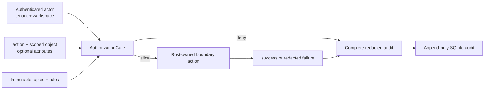

# Extend scoped authorization and audit safely

Rust now provides a deny-by-default policy-v2 evaluator and one audit gate for commands, queries, synchronization, external adapters, and plugin capabilities. The existing direct organization policy remains the persisted administration path for configuration while product verticals adopt scoped objects and generic tuples.

## Authority and public boundaries

| Concern | Rust authority |
| --- | --- |
| Typed actor, object, tuple, condition, rule, request, and decision contracts | `crates/contracts/src/identity.rs` and `crates/contracts/src/authorization.rs` |
| Direct organization policy, owner bootstrap, relationship administration | `crates/authorization/src/lib.rs` |
| Immutable policy-v2 graph and `can(actor, action, object)` | `crates/authorization/src/policy.rs` |
| Common authorization/audit gate | `crates/authorization/src/boundary.rs` |
| Query and command dispatch enforcement | `crates/engine-runtime/src/dispatcher.rs` |
| Sync, provider, and plugin boundary adapters | `crates/sync`, `crates/external-integrations`, and `crates/extensions` |
| Audit envelope, redaction, completeness, and extension markers | `crates/observability-audit/src/lib.rs` |
| Append-only audit persistence and migration | `crates/storage/src/audit.rs` and `crates/storage/src/lib.rs` |

Native shells may display projected permissions. They never evaluate tuples, assert roles, add conditions, authorize plugins, call providers directly, or write audit rows.

## Policy-v2 model

A `ScopedObject` binds an object UUID and kind to one tenant and an optional workspace. A `RelationshipTuple` has the shape `subject — relation → object`. The subject is either an authenticated principal or another scoped object such as a role, team, or parent record. Roles are ordinary objects: a principal receives `eitmad.relation.role.member.v1` on a role, and that role receives a product relation on the protected object.

A `PermissionRule` maps one action and object kind to grant relations. Its `inherits_via` relations identify explicit parent edges. `RelationshipPolicy::can` evaluates direct relations, role membership, nested roles, and parent objects against one immutable snapshot. It returns the granting relation and source object when allowed, plus whether the permission was inherited. Missing rules, missing tuples, cycles, failed conditions, and the depth limit all deny.

Conditions are optional and request-local. Policy v2 supports exact string equality plus nested `all` and `any`. Attributes are untrusted inputs; a product vertical must define canonical keys and values and must never put secrets or raw customer data in them. An unconditional relation is represented by no condition, not an always-true client assertion.

## Isolation and inheritance invariants

- The actor tenant must equal the target tenant.
- A workspace-scoped target requires the actor's exact workspace. A tenant-wide target may have no workspace but still requires the exact tenant.
- A tuple whose object subject crosses a tenant or workspace is rejected when the policy snapshot is built.
- Parent and role traversal is bounded to 16 edges and cycle-safe. Exhaustion denies rather than returning partial access.
- Direct organization permission lookup rejects a tenant that differs from its organization scope or any unexpected workspace before reading relationships.
- Principal UUID equality never overrides tenant/workspace checks.
- Rules are unique per action and object kind and must name at least one grant relation.
- Policy snapshots are immutable during one decision. Replace the whole validated snapshot after a policy update.

These controls prevent a matching UUID, role, or parent edge in one workspace from granting access in another.

## Boundary enforcement

`AuthorizationGate::authorize` covers five explicit boundary kinds: command, query, sync, external adapter, and plugin capability, and durably records denials without invoking product work. `AuthorizationGate::execute_read` is restricted to read-only callbacks and records their result after execution. `SyncAuthorization`, `ExternalActionAuthorization`, and `PluginCapabilityAuthorization` force their correct boundary kind before delegation. Unsupported engine commands are rejected and audited; all query outcomes are audited, and an audit persistence failure withholds the query response.

State-changing product code may use `authorize` for the decision but must keep mutation state, idempotency, publication, and its successful or failed audit result in one domain transaction. It must not place an irreversible provider call inside `execute_read` or use a post-action audit call to claim atomicity. Existing configuration and direct relationship mutations already commit their audit with authoritative state.

Subscriptions reauthorize before delivery. Protocol `1.2` policy-change behavior remains: a revoked `1.2+` stream closes with `authorizationRevoked`, while older peers terminate without receiving an unknown close reason.

## Mandatory audit envelope

Every new audit record contains:

- actor principal ID and kind;
- device attribution as an explicit optional value for valid device-less service contexts;
- mandatory session ID;
- tenant ID, explicit optional workspace ID, and exact operation scope;
- command or boundary operation identifier;
- typed target kind and sanitized identifiers;
- outcome and timestamp;
- correlation ID plus optional causation and idempotency IDs;
- optional revisions and changed identifiers;
- only a stable redacted error code and coarse error class;
- one durable boundary-classification marker for common gate records plus zero or more declared workflow extension markers.

`validate_complete` rejects an empty operation, empty target kind, any redacted error outside the validated stable identifier grammar, or any failed/denied/invalid/conflicting outcome without a redacted error. Storage version 6 persists tenant, workspace, target, redacted error, and extension markers in the append-only audit table. Historical pre-v6 rows keep nullable added columns; new Rust writes must pass completeness validation.

Raw error messages, payloads, secrets, Arabic customer text, authorization graphs, and provider responses do not belong in audit. Hash or otherwise sanitize sensitive target identifiers according to the owning vertical; direct relationship grants already use a versioned SHA-256 principal fingerprint.

## Audit extension points

`AuditExtensionPoint` stores validated boundary markers for `CommandBoundary`, `QueryBoundary`, `SyncBoundary`, `ExternalAdapterBoundary`, and `PluginCapabilityBoundary`. It also reserves workflow markers for `Approval`, `Ledger`, `Conflict`, `SecurityEvent`, and `UndoCritical`. A workflow marker does not implement that workflow. The future owning vertical must define lifecycle, storage, authorization, retention, idempotency, recovery, and read models before using it. Ledger and undo-critical work must remain atomic with domain state; security events need separate alerting and retention policy.

## Direct organization policy compatibility

Policy v1 still persists direct principal-to-organization `member`, `config-manager`, and `owner` relationships. Members read configuration and effective permissions; managers also patch/import/export; owners also manage relationships and hold `eitmad.permission.observability.sensitive-debug.v1`. `AuthorizationService` implements the diagnostic permission gate, so denied sensitive-debug requests cannot activate or disable the mode. Rust preserves one persisted owner and supports a Rust-only first-owner bootstrap. Development ephemeral ownership remains explicitly insecure and non-persistent.

Do not encode product-v2 roles or inherited record access into the v1 relation table. Provision them through a versioned policy snapshot and later persistence migration once a product vertical owns the tuple lifecycle.

## Protocol, Arabic, and operations

Protocol `1.3` adds mandatory tenant and optional workspace authorization context. Local IPC requires `eitmad.capability.authorization-scopes.v1` for every accepted protocol version. Deploy regenerated engine and shell bindings together. No authorization-management UI exists. Future Arabic UI must localize denial and approval states, render RTL correctly, and isolate UUIDs, relation/action identifiers, revisions, and correlation IDs for reliable mixed-direction copy/paste. Policy evaluation has no locale branch.

On `eitmad.error.authorization-denied.v1`, verify authenticated tenant/workspace, object scope, action rule, direct/role tuple, parent edge, and conditions without dumping the graph. On audit or policy storage failure, fail closed and follow [authorization boundary troubleshooting](../../troubleshooting/authorization-boundary-denials.md).

## Tests and safe extension

Tests cover direct allow/deny, the owner-only sensitive-debug permission, role relationships, inherited permissions, attribute conditions, tenant/workspace isolation, cross-scope tuple rejection, unauthorized commands/queries, sync rejection, external-adapter rejection, plugin rejection, audit completeness/redaction, append-only persistence, storage migration, direct policy decisions, last-owner protection, and subscription revocation.

Run focused authorization/audit/storage/runtime tests, full workspace tests, strict Clippy, generated contract verification, C# conformance, and an engine diagnostic plus clean start/stop. Before adding a relation or condition, document its product meaning, authoritative attributes, scope, denial behavior, Arabic UX, tuple lifecycle, migration, and revocation bound. Review [ADR-0023](../../decisions/0023-scoped-relationship-authorization-and-audit.md), [protocol 1.3 release guidance](../../releases/protocol-1-3-scoped-authorization-audit.md), and the [contract reference](../../api/index.md).
