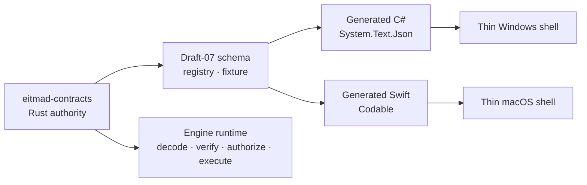

# Maintain the authoritative contract layer

The contracts capability gives every external peer one Rust-owned protocol without moving business execution into the contract crate. It owns shapes and compatibility helpers; engine runtime, authorization, persistence, synchronization behavior, and update policy remain in their dedicated crates.

## Boundary and data flow

The generated model describes untrusted input. The engine must authenticate the channel, compare the payload session and scope with channel state, validate bounds and domain invariants, authorize with ReBAC, execute atomically, and emit the required audit outcome.

## Invariants

- Rust definitions and the Rust protocol catalog are the only editable sources of wire shapes and identifiers.
- Commands, queries, subscriptions, and events remain distinct typed envelopes.
- Every operation has explicit identity, session, scope, correlation, version, and deadline context; retryable mutation also has an idempotency key.
- Unknown additive fields are tolerated. Unknown required operations fail closed.
- Open identifiers are validated during Rust deserialization and preserved when their meaning is optional and unknown.
- Error prose, localization, bidi controls, secrets, and raw permission graphs do not become protocol control data.
- Sync messages are bounded and transport-independent; domain-specific reconciliation is not implemented in this crate.

## Arabic and mixed-direction behavior

JSON is Unicode and preserves Arabic or mixed Arabic/Latin values unchanged. Canonical data contains no presentation-only bidi controls. Stable message IDs and typed parameters cross the boundary; shells render localized Arabic text and apply directionality. The deterministic fixture includes `خزانة Wardrobe 120 cm - فرع صنعاء` and `ملف عرض السعر Quote-١٢.pdf` to detect encoding loss in Rust, C#, and Swift.

### Arabic-first feature gate

| Result | Checklist area | Evidence or reason |
| --- | --- | --- |
| Pass | Unicode IPC, canonical values, stable message IDs, typed parameters, and exclusion of bidi controls | Rust serialization and compatibility tests |
| Pass | Shared Arabic, Latin, numerals, filename, and mixed-direction fixtures | Generated protocol fixture and .NET conformance runner |
| Not applicable | RTL layout, focus, keyboard input, typography, accessibility, search, reports, PDF, and printing | This capability has no UI, search behavior, or document renderer; shells remain blocked on their full pre-shell gate |
| Not applicable | Default locale, calendar, time zone, digits, currency, fonts, and fallback policy | Protocol v1 can transport canonical values but does not select product presentation policy; the registered locale key defines no default |
| Not applicable | Local Swift compiler execution | The current Windows environment has no Swift toolchain; mandatory macOS CI owns compilation and fixture execution before merge |

The missing local Swift toolchain does not authorize shell implementation or bypass CI. Its review trigger is any Swift generator, schema, or macOS toolchain change.

## Failure modes

| Failure | Safe behavior | Owning evidence |
| --- | --- | --- |
| Incompatible major or missing required capability | Reject negotiation before normal requests | `versioning::negotiate` tests |
| Invalid protocol identifier | Reject during Rust deserialization | transport tests |
| Unknown required operation | Reject the tagged union | transport compatibility test |
| Stale configuration revision | Return `eitmad.error.config-revision-conflict.v1`; do not overwrite | typed config/error contracts |
| Oversized page or sync batch | Reject against declared bounds | transport and sync tests/schema |
| Generated binding differs | Fail deterministic drift check | codegen check and CI |

## Tests and observability

Unit tests live beside contract behavior. Cross-language fixtures and runners live under `tests/contract-compatibility/`. CI checks Rust formatting, strict Clippy, tests, generated drift, .NET compilation/round-trip, Swift compilation/round-trip, Unicode preservation, and forbidden handwritten shell identifiers.

Contracts expose correlation identifiers and safe structured errors. They do not authorize logging payloads. Diagnostics must record only approved identifiers, versions, negotiation outcomes, bounds, and redacted failure metadata.

## Safe extension points

- Add a foundation concern inside this crate only when several external peers need the same stable boundary.
- Add product-domain commands and payloads in their owning vertical, then expose only the deliberate contract surface.
- Register every new operation, capability, permission, config key, schema ID, error code, message ID, and parameter name before generation.
- Use a capability for optional behavior. Increment the protocol major when an older peer cannot interpret the new meaning safely.
- Add Linux output only after its shell technology ADR; do not preselect a language through the generator.

Next, use the [protocol v1 reference](../../api/index.md) when adding a client or [resolve generated contract drift](../../troubleshooting/contract-binding-drift.md) when outputs disagree.
