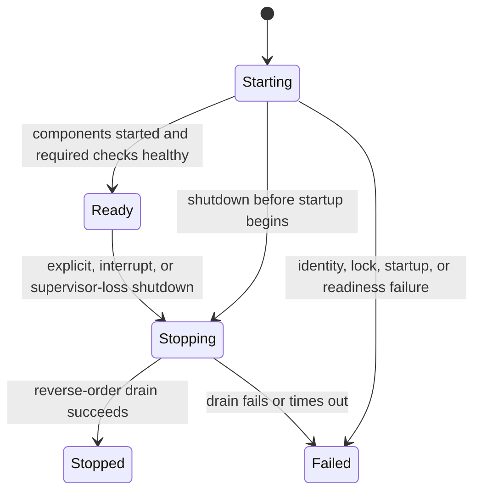

# Extend the engine runtime lifecycle safely

`eitmad-engine-runtime` is the Rust authority for starting, observing, and stopping one engine process. It supplies the same lifecycle behavior to supervised desktop and independent headless launchers; diagnostic mode reuses non-mutating health checks without becoming an authority.

## Ownership and boundaries

| Concern | Authority |
| --- | --- |
| External lifecycle, identity, health, diagnostic, and error shapes | `eitmad-contracts::runtime` and `eitmad-contracts::errors` |
| Component order, readiness, deadlines, rollback, shutdown, and authority lock | `eitmad-engine-runtime` |
| CLI arguments, stdout/stderr adaptation, Ctrl+C, and supervisor stdin EOF | `eitmad-engine-cli` |
| Windows process containment, restart budget, stale-event rejection, and shell-owned shutdown | [Windows process supervision](windows-process-supervision.md) |
| Typed local command/query transport | `eitmad-engine-runtime::local_ipc`; delegates shutdown to this lifecycle |

The CLI does not own business logic, storage, authorization, or diagnostics policy. The supervisor PID and inherited stdin control pipe only coordinate process lifetime; neither proves identity or grants authorization.

## Lifecycle and readiness



The normal transition path is `Starting → Ready → Stopping → Stopped`. `Failed` is terminal. Component startup and readiness checks each receive a separate 30-second deadline by default, so a slow component cannot consume the readiness-check budget or change failure attribution. Shutdown receives one total 10-second deadline. Tests may configure shorter deadlines through `RuntimeBuilder`.

Readiness is not the same as process liveness:

- `live` is true in `Starting`, `Ready`, and `Stopping`;
- `ready` is true only in `Ready` while every `RequiredForReadiness` check is `Healthy`;
- an advisory non-healthy check degrades aggregate health without blocking readiness;
- a required non-healthy check blocks startup or makes a refreshed ready runtime unready.

`RuntimeComponent` implementations start in registration order and stop in reverse order. A partial startup failure stops every component that already started before releasing the authority lock. Components return an opaque `ComponentFailure`; raw causes do not cross the public diagnostic boundary.

## Process identity and single authority

Every launch receives a new `EngineInstanceId` plus PID, mode, Unix start time, product version, and protocol version. PID reuse means PID alone is never identity or authentication.

Authoritative modes acquire `engine.authority.lock` under the platform runtime-data directory. The OS lock, not the file contents, enforces exclusivity. The JSON contents support local correlation only. A crash releases the OS lock; a replacement process safely overwrites stale metadata. Diagnostic mode does not acquire the lock or start runtime components.

The current lock is one authority per runtime directory. Future scoped multi-engine support must define an authority key and migration before changing that rule.

## Structured failures and privacy

Lifecycle failures use `ContractError` with a stable error code, localization message ID, retry disposition, correlation ID, and `LifecycleStage`. Current identifiers are in the [generated protocol reference](../../_generated/contracts-v1.md).

Public snapshots and stderr output exclude raw I/O errors, component errors, paths, secrets, product payloads, customer data, and authorization graphs. Native shells must localize `messageId`; they must not parse Rust prose. Machine fields remain locale-independent UTF-8 JSON. No Arabic UI is implemented by this subsystem, so RTL rendering is not applicable yet.

## Safe extension points

- Add a `RuntimeComponent` when a capability needs ordered initialization and bounded draining.
- Add a `HealthCheck` with a stable `eitmad.health.*` ID and deliberate readiness impact.
- Keep component-specific behavior inside its owning vertical; the runtime only coordinates it.
- Add external lifecycle fields through the Rust contract evolution and binding-generation workflow.
- Do not use stdout status events as authenticated IPC. Extend the [implemented local IPC boundary](local-ipc.md) behind capability negotiation and the existing runtime state.

## Arabic-first completion record

This records every item in the [Arabic-first feature checklist](../contributing/arabic-first-feature-checklist.md) for this non-UI runtime foundation. “Not applicable” does not approve a global product decision; it means this change neither consumes nor implements that surface.

### Pre-shell product decisions

| Checklist item | Result |
| --- | --- |
| Default locale and fallback | Not applicable: machine JSON is locale-independent; no shell starts |
| Calendar, time zone, date precision, relative dates | Not applicable: timestamps are canonical Unix milliseconds |
| Input and display digits | Not applicable: no human input or formatted display |
| Currency and rounding | Not applicable: no monetary values |
| UI/document fonts | Not applicable: no UI or document rendering |
| Localization contracts | Pass: every runtime failure has a stable `messageId`, typed retry metadata, and safe lifecycle detail |
| Search normalization | Not applicable: no searchable domain |
| Shared Arabic/Latin/bidi fixtures | Pass: protocol UTF-8 and mixed-direction round-trip contract tests remain active |
| Accessibility verification platforms | Not applicable: no presentation surface |
| PDF/print baselines | Not applicable: no generated documents |

### Feature design and ownership

| Checklist item | Result |
| --- | --- |
| Designed first in Arabic and RTL | Not applicable: no visible workflow or layout |
| Rust vertical owns meaning and outcomes | Pass: `eitmad-engine-runtime` owns lifecycle behavior and Rust contracts own external shapes |
| Shell owns presentation only | Pass: CLI adapts arguments, pipes, and signals without business authority |
| Feature document records Arabic behavior and gaps | Pass: this record states applicability and unavailable platform evidence |

### RTL layout and interaction

| Checklist item | Result |
| --- | --- |
| Logical layout properties | Not applicable: no layout |
| RTL navigation, focus, and dialogs | Not applicable: no interactive UI |
| Icon and media mirroring | Not applicable: no visual assets |
| RTL tables | Not applicable: no rendered tables in the product |
| Visual loading, failure, scaling, offline, and conflict states | Not applicable: states are machine JSON only |

### Bidirectional text and input

| Checklist item | Result |
| --- | --- |
| Isolate mixed-direction visible values | Not applicable: no visible labels or values |
| Prevent user text from reordering UI/security identifiers | Not applicable: diagnostics exclude user-controlled product text |
| Mixed-direction editing and copy/paste | Not applicable: no text editor |
| Arabic/Latin keyboard switching | Not applicable: no input controls |
| Exclude presentation bidi controls from canonical values | Pass: existing contract tests verify mixed Arabic/Latin UTF-8 without injected bidi controls |

### Typography and localization

| Checklist item | Result |
| --- | --- |
| Arabic shaping, glyphs, and clipping | Not applicable: no rendering |
| Arabic typography under visual states | Not applicable: no rendering |
| Complete localized messages | Not applicable to the CLI: it emits stable IDs for future shell localization, not human fragments |
| Missing-translation diagnostics | Not applicable: no translation catalog is loaded |
| Arabic accessible names and announcements | Not applicable: no accessibility tree |

### Validation and errors

| Checklist item | Result |
| --- | --- |
| Stable message ID, parameters, target, and recovery metadata | Pass: `ContractError` supplies message ID, retry disposition, correlation ID, and lifecycle stage; field targeting is not applicable to process failures |
| Validation explains correction without data loss | Not applicable: no user data entry; operations guidance maps each code to recovery |
| Command failure states preservation, retry, and next action | Not applicable: command dispatch is not implemented; lifecycle failures provide retry metadata and documented recovery |
| Field errors remain accessible | Not applicable: no fields or UI |
| Security errors avoid sensitive policy and data disclosure | Pass: public failures exclude raw I/O/component errors, paths, secrets, payloads, and authorization graphs |

### Dates, numbers, units, and currency

| Checklist item | Result |
| --- | --- |
| Locale-aware formatters and parsers | Not applicable: machine values are not localized |
| Identifiers are not parsed as numbers | Pass: instance and correlation IDs are UUID types; PID is explicitly numeric correlation metadata |
| Ambiguous date/number input | Not applicable: no human date or number input |
| Currency precision and symbols | Not applicable: no currency |
| RTL dimensions | Not applicable: no dimensions |
| Canonical machine values | Pass: timestamps use Unix milliseconds and versions use typed protocol/product versions |

### Search and sorting

| Checklist item | Result |
| --- | --- |
| Normalization and ranking policy | Not applicable: no searchable domain |
| Preserve original values beside normalized indexes | Not applicable: no search index |
| Avoid collapsing distinct names/identifiers | Not applicable: no name normalization |
| Grapheme-correct highlighting | Not applicable: no highlighting |
| Locale sorting and tie-breakers | Not applicable: no sorting |
| Scope filtering before search disclosure | Not applicable: no search counts, suggestions, or results |

### Reports, PDF, print, and exports

| Checklist item | Result |
| --- | --- |
| Arabic document rendering | Not applicable: no document generation |
| Paper, margin, scaling, and pagination policy | Not applicable: no paged output |
| Monochrome usability | Not applicable: no visual output |
| Platform print preview and printer verification | Not applicable: no printing |
| CSV/spreadsheet behavior | Not applicable: no tabular export |
| Accessibility or archival conformance | Not applicable: no retained document artifact |

JSON lifecycle and diagnostic streams are protocol output, not localized reports.

### Test evidence and completion

| Checklist item | Result |
| --- | --- |
| Unit validation/parsing/formatting/search tests | Not applicable to domain behavior; lifecycle unit tests cover this feature's Rust invariants |
| Contract Unicode, message, version, and capability tests | Pass: Rust contract tests, generated drift checks, and .NET conformance pass |
| Shell RTL/accessibility conformance | Not applicable: no shell implementation |
| End-to-end Arabic workflow and recovery | Not applicable: no product workflow; subprocess tests cover lifecycle failure recovery |
| Rendered generated documents | Not applicable: no documents |
| Clean build and run on affected available platforms | Pass on Windows: format, check, Clippy, workspace tests, diagnostics, and supervised shutdown pass without warnings; macOS/Linux execution remains CI evidence when available |
| Documentation links evidence and gaps | Pass: tests, operations, troubleshooting, and this platform limitation are linked here |

## Tests and verification

Unit tests beside the runtime cover transitions, order, rollback, required and advisory health, separate component-startup and readiness-check deadlines, shutdown deadlines, identity uniqueness, diagnostic isolation, and lock replacement. CLI integration tests cover process readiness, stdin-EOF shutdown, invalid supervision, diagnostics, duplicate processes, and exit codes. Windows adapter tests cover intentional stop, unexpected death, restart exhaustion, stale events, Job Object timeout termination, and the real engine lifecycle.

Run the focused checks:

```powershell
cargo test -p eitmad-engine-runtime -p eitmad-engine-cli
```

Then [run and diagnose the engine](../../operations/run-engine-runtime.md) or [resolve startup failures](../../troubleshooting/engine-startup-failures.md).
