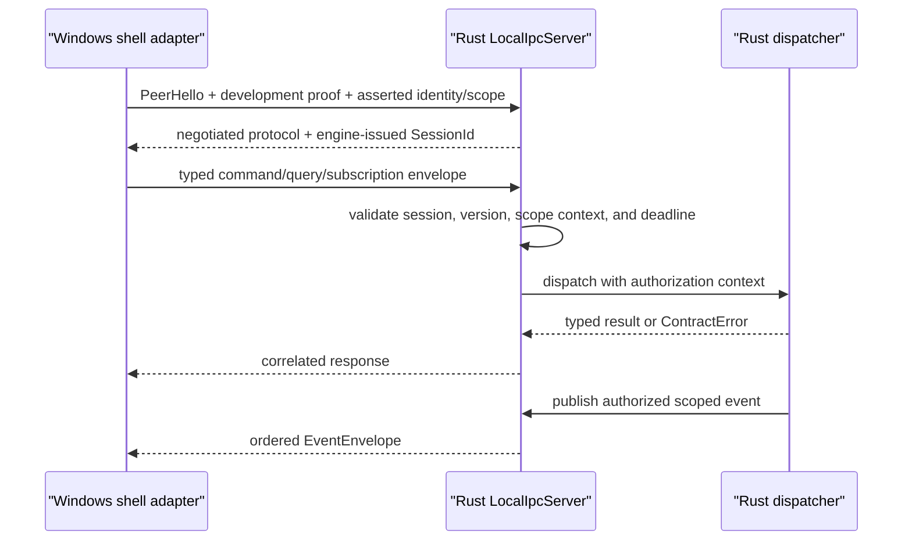

# Extend typed local IPC safely

Typed local IPC carries Rust-owned commands, queries, subscriptions, and events between the Windows adapter and the separate Rust engine. The current transport is a Windows named pipe; Rust owns negotiation, session validation, scoped subscription authorization, bounded replay, ordering, and structured outcomes.

## Ownership and boundary

| Concern | Authority |
| --- | --- |
| Wire messages, errors, versions, capabilities, identity, and scope | `eitmad-contracts` |
| Framing, sessions, dispatch, scoped replay, ordering, and backpressure | `eitmad-engine-runtime::local_ipc` |
| Pipe discovery, bounded async streams, processed cursors, and shutdown adaptation | `Eitmad.Platform.Windows.LocalIpc` |
| Generation-aware reconnect and resubscribe | `Eitmad.Platform.Windows.ProcessSupervision` |
| Domain validation, ReBAC authorization, storage, audit, and sync | Each owning Rust product vertical |

Shells use generated contract bindings. They must not copy schemas, parse error prose, trust their own identity assertion, or treat a connected pipe as authorization.

## Connection and request flow

The handshake is mandatory. Rust negotiates protocol `1.0` or `1.1`. Protocol `1.0` remains command/query-only; subscriptions require protocol `1.1` plus `eitmad.capability.local-ipc-subscriptions.v1`. Each accepted connection receives a new `SessionId`; envelopes must reproduce the negotiated protocol and exact authorization context.

## Subscription streams and payload ownership

Rust currently defines streams for configuration, effective permissions, sync status/progress, update state, record-change metadata, background jobs, notifications, and asynchronous errors. Record events carry scope, record ID, schema ID, operation, revision, and change time—not encoded domain payloads. The consuming vertical must query its authoritative projection after a fresh or forced resync.

Every publisher supplies an authorized `ScopeRef`. The broker rejects events whose embedded configuration, record, job, notification, or error scope disagrees. Subscription authorization occurs after session validation and before replay lookup; an unknown, expired, wrong-stream, or wrong-scope cursor produces the same `eitmad.error.ipc-subscription-resync-required.v1` result.

Subscribe and unsubscribe are read-only and do not create audit records. The command or background process that caused a state change retains its vertical's ReBAC and audit obligations.

## Ordering, replay, and duplicate delivery

An accepted subscription receives an opaque stream cursor and a new subscription ID. Events are ordered by engine publish order within that subscription; `sequence` starts at `1` and is contiguous for delivered events. Replay is delivered before live events without a gap. No order is promised across subscriptions or between a command response and an event caused by that command.

Replay is in-memory and valid only for the current engine generation. The broker retains at most 1,024 entries and 16 MiB globally. Delivery is at least once from the last cursor acknowledged after shell processing, so consumers must apply state by revision or otherwise tolerate duplicates. Engine restart, eviction, or a mismatched cursor requires subscribe-first, query-current-state, then apply buffered live events.

## Backpressure and drop policy

The engine live channel and each Windows consumer queue hold 256 events. Configuration, permission, sync, and update status are replaceable state: if their cursor is evicted during lag, the broker delivers the newest retained value. Background-job status, record changes, notifications, and errors are discrete and are never silently dropped because one scope can contain multiple independent records or jobs. If a discrete gap cannot be replayed, Rust sends `SubscriptionClosed` with reason `backpressure`; the Windows client fails the connection so supervision reconnects and resubscribes from the last processed cursor.

Slow shells never block authoritative producers. Repeated backpressure therefore reduces shell availability, not engine correctness. A vertical must reduce event frequency or add a query/page boundary instead of increasing bounds ad hoc.

The development authenticator is not production authentication. It accepts a 256-bit random bearer token passed through the child environment only when `--allow-insecure-development-auth` is explicit. It then accepts the synthetic asserted identity and scope. Production packaging must keep this flag disabled until a reviewed peer and user authentication design replaces it.

## Framing, concurrency, and large payloads

Frames contain a four-byte little-endian length followed by UTF-8 JSON. The hard limit is 8 MiB. An oversized declared input is rejected before payload allocation; an oversized output closes only its connection while the accept loop remains available. Domain APIs must page or stream data that cannot fit this bound. Temporary-file handoff and unbounded reassembly are not supported.

The server creates the next named-pipe instance before serving an accepted connection, so reconnecting clients do not encounter a missing-listener gap. It dispatches independent commands and queries concurrently and returns responses by `RequestId`; callers must not infer completion order. One background Windows reader routes responses and events, buffers an event that races its subscribe acknowledgement, and rejects events for unknown subscriptions.

## Deadlines, errors, and retries

Connection timeout defaults to five seconds and request timeout to 30 seconds; both are configurable. Rust rejects an expired envelope before dispatch and stops awaiting a command or query dispatcher future when its deadline passes. A command may have produced partial or committed effects before cancellation, so a shell-side command timeout still means outcome unknown; retry only with the same idempotency key.

Stable failures include session invalid, deadline exceeded, payload too large, subscription unsupported, subscription resync required, engine stopping, and protocol incompatible. An unavailable engine has no Rust response, so `EngineIpcClient` reports a typed local `EngineUnavailable` failure. No path logs bearer tokens, raw frames, product payloads, customer data, or authorization graphs.

The Windows supervisor retains subscription descriptors and processed cursors across engine generations. A lost connection retries after 100 ms, 500 ms, two seconds, then every five seconds while that generation remains `Ready`. Same-engine reconnect replays from the processed cursor. A new engine normally rejects the old cursor; the supervisor opens a fresh stream, raises `ResyncRequired`, and resets its watermark so the owning UI can re-query without polling.

## Shutdown and recovery

`RequestShutdownAsync` receives an acknowledgement before Rust begins bounded runtime draining. Windows then closes inherited stdin as well: this preserves abandoned-supervisor detection and releases the blocked Windows stdin reader. If IPC is unavailable, stdin EOF remains the graceful fallback. The existing 15-second supervisor deadline and Job Object termination remain the final recovery boundary.

## Arabic-first behavior and tests

The transport preserves canonical Unicode and does not add bidirectional controls. Tests round-trip a multi-megabyte synthetic Arabic/Latin value such as `خزانة Wardrobe 120 cm - فرع صنعاء`. There is no UI in this capability, so RTL layout, Arabic labels, input, accessibility, and localized rendering remain the future shell's responsibility. Shells will localize `messageId` and directionally isolate machine identifiers.

Focused Rust tests cover protocol `1.0` fallback, subscription capability gates, scope mismatch, replay, cursor isolation, ordering, coalescing, discrete overflow, command/query behavior, and frame bounds. Windows scenarios cover bounded event queues, processed cursor acknowledgement, stable stream reattachment, real-engine negotiation, and graceful shutdown. Extend event production through `EventBroker`; keep payload meaning and authoritative queries in the owning vertical.

For the durable event-stream decision, see [ADR-0018](../../decisions/0018-bounded-resumable-local-ipc-events.md). For exact contracts, see [protocol v1](../../api/index.md). For threats, see the [local IPC threat model](../../architecture/local-ipc-threat-model.md). For recovery, use [Resolve local IPC failures](../../troubleshooting/local-ipc-failures.md).
