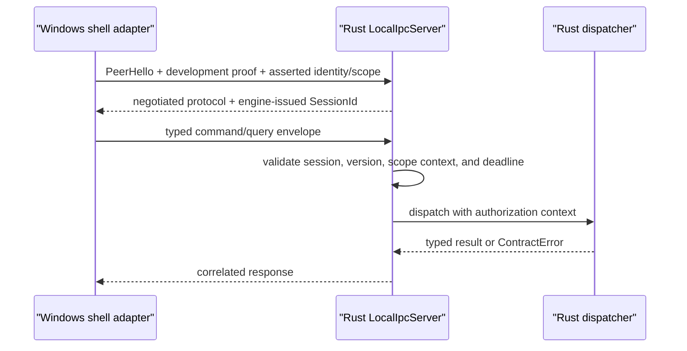

# Extend typed local IPC safely

Typed local IPC carries Rust-owned commands and queries between the Windows adapter and the separate Rust engine. The current transport is a Windows named pipe; Rust owns negotiation, session validation, deadlines, dispatch, and structured outcomes.

## Ownership and boundary

| Concern | Authority |
| --- | --- |
| Wire messages, errors, versions, capabilities, identity, and scope | `eitmad-contracts` |
| Framing, handshake validation, sessions, deadlines, and dispatch | `eitmad-engine-runtime::local_ipc` |
| Pipe discovery, async client calls, unavailable-engine mapping, and shutdown adaptation | `Eitmad.Platform.Windows.LocalIpc` |
| Domain validation, ReBAC authorization, storage, audit, and sync | Each owning Rust product vertical |

Shells use generated contract bindings. They must not copy schemas, parse error prose, trust their own identity assertion, or treat a connected pipe as authorization.

## Connection and request flow

The handshake is mandatory. Rust selects protocol `1.0`, requires the local-IPC capability when requested by the shell, and rejects incompatible peers before normal traffic. Each accepted connection receives a new `SessionId`; envelopes must reproduce the negotiated protocol and exact authorization context.

The development authenticator is not production authentication. It accepts a 256-bit random bearer token passed through the child environment only when `--allow-insecure-development-auth` is explicit. It then accepts the synthetic asserted identity and scope. Production packaging must keep this flag disabled until a reviewed peer and user authentication design replaces it.

## Framing, concurrency, and large payloads

Frames contain a four-byte little-endian length followed by UTF-8 JSON. The hard limit is 8 MiB. An oversized declared input is rejected before payload allocation; oversized output fails locally. Domain APIs must page or stream data that cannot fit this bound. Temporary-file handoff and unbounded reassembly are not supported.

The server dispatches independent commands and queries concurrently and returns responses by `RequestId`; callers must not infer completion order. The Windows client uses one background reader and a pending-request map, so late responses are discarded after the caller deadline without corrupting later calls.

## Deadlines, errors, and retries

Connection timeout defaults to five seconds and request timeout to 30 seconds; both are configurable. Rust rejects an expired envelope before dispatch and cancels a query future when its deadline passes. It does not forcibly abort a command that has begun because a committed result could otherwise be reported falsely. A shell-side command timeout therefore means outcome unknown; retry only with the same idempotency key.

Stable failures include session invalid, deadline exceeded, payload too large, engine stopping, and protocol incompatible. An unavailable engine has no Rust response, so `EngineIpcClient` reports a typed local `EngineUnavailable` failure. No path logs bearer tokens, raw frames, product payloads, customer data, or authorization graphs.

## Shutdown and recovery

`RequestShutdownAsync` receives an acknowledgement before Rust begins bounded runtime draining. Windows then closes inherited stdin as well: this preserves abandoned-supervisor detection and releases the blocked Windows stdin reader. If IPC is unavailable, stdin EOF remains the graceful fallback. The existing 15-second supervisor deadline and Job Object termination remain the final recovery boundary.

## Arabic-first behavior and tests

The transport preserves canonical Unicode and does not add bidirectional controls. Tests round-trip a multi-megabyte synthetic Arabic/Latin value such as `خزانة Wardrobe 120 cm - فرع صنعاء`. There is no UI in this capability, so RTL layout, Arabic labels, input, accessibility, and localized rendering remain the future shell's responsibility. Shells will localize `messageId` and directionally isolate machine identifiers.

Focused Rust tests cover handshake denial, version mismatch, session rejection, command/query success, query deadline, large payloads, and oversized frames. Windows scenarios cover unavailable endpoints, the shared frame limit, real-engine negotiation, and graceful shutdown. Extend domain behavior behind the dispatcher traits; do not add it to transport code.

For exact contracts, see [protocol v1](../../api/index.md). For threats, see the [local IPC threat model](../../architecture/local-ipc-threat-model.md). For recovery, use [Resolve local IPC failures](../../troubleshooting/local-ipc-failures.md).
