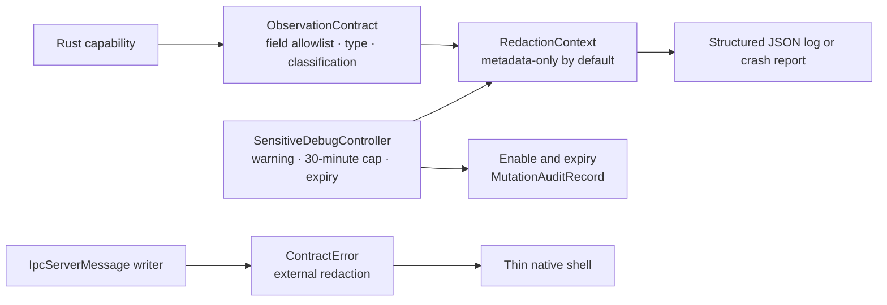

# Extend privacy-preserving observability safely

`eitmad-observability-audit` is the Rust authority for diagnostic field contracts, structured logs and errors, crash-report projections, redaction, correlation, and temporary sensitive-debug state. Routine output is metadata-only. Secret-classified fields are always redacted, including during sensitive debugging.

## Ownership and boundary flow



`crates/contracts/src/observability.rs` owns stable event, component, field, severity, classification, and value-kind types. `crates/observability-audit/src/diagnostics.rs` applies those contracts. The engine CLI uses the same metadata-only path for operational failures. Local IPC applies `ContractError::redacted_for_external_boundary` again immediately before serialization, so a faulty internal dispatcher cannot send raw error text.

## Redaction contract

Every field must be declared once with a name, value kind, and classification. Unknown fields, duplicate declarations, and type mismatches fail before serialization.

| Classification | Routine output | Active sensitive debug | IPC errors and crash reports |
| --- | --- | --- | --- |
| `Metadata` | Included | Included | Included only through an approved structured projection |
| `Sensitive` | `redacted` | Included until exact expiry | Never copied from raw causes; crash inclusion requires an already-redacted structured log |
| `Secret` | `redacted` | `redacted` | Always absent |

Structured output fields are private Rust state. Callers cannot construct a `StructuredLog`, `StructuredError`, or `CrashReport` by filling arbitrary public maps. `ObservationContract::redact` is the creation boundary.

## Correlation and structured errors

Every structured log and error carries a `CorrelationId`. Command, query, subscription, lifecycle, and CLI failure paths preserve or create a correlation ID without logging request payloads. `ContractError` external projection retains stable codes, message IDs, retry policy, correlation, safe numeric details, and allowlisted metadata only. It removes free text, mismatched parameter kinds, and compatibility reasons.

Correlation IDs support search and sequence reconstruction; they are not authentication proof, business record identifiers, or permission to join data across scopes.

## Temporary sensitive-debug lifecycle

`SensitiveDebugController::enable` accepts an authorized context, correlation ID, current `UnixMillis`, and positive duration no greater than 30 minutes. It returns:

- the exact warning `SENSITIVE_DEBUG_WARNING` through active status;
- an enable audit record marked `SecurityEvent` and `SensitiveDebugMode`;
- an expiry timestamp calculated without overflow.

At `now >= expiresAt`, `evaluate` returns metadata-only redaction and one expiry audit record, then becomes disabled. Overlapping sessions, zero duration, over-limit duration, and timestamp overflow are rejected. Secret fields never become visible.

No IPC, CLI, or shell control currently enables this mode. A future authorized boundary must durably append the returned enable record before using the active redaction context, append the expiry record, restrict access to emitted diagnostics, and fail closed if audit persistence fails. It must not turn sensitive debug into a global environment variable or permanent setting.

## Security, audit, and Arabic behavior

Normal logs, IPC errors, crash reports, configuration snapshots, and audit payloads exclude raw causes, customer text, product payloads, credentials, and secret material. Sensitive-debug audit targets contain only expiry metadata; they do not contain diagnostic field values.

No user-facing observability UI exists. Future Arabic warnings must render the localized equivalent of the stable warning in RTL, isolate LTR correlation and error identifiers, preserve copy/paste, and never collect Arabic customer text merely for readability. Rust identifiers remain language-neutral.

## Failure modes and recovery

| Failure | Safe behavior | Recovery |
| --- | --- | --- |
| Unknown or wrong-kind field | Reject event construction | Fix the owning `ObservationContract`; do not weaken classification |
| Raw text in internal `ContractError` | Strip it at the external projection and IPC writer | Replace it with a stable code or allowlisted typed metadata |
| Sensitive-debug duration invalid | Reject activation | Request a positive duration within 30 minutes |
| Sensitive-debug expiry reached | Return metadata-only context and one expiry audit | Persist expiry audit; start a separately authorized session only if still necessary |
| Serialization failure | Emit only a stable fallback event and correlation ID | Diagnose the structured schema; never print the raw value |
| Suspected sensitive output | Treat as a privacy incident | Follow [diagnostic leakage recovery](../../troubleshooting/privacy-and-secret-leakage.md) |

No persistent diagnostic sink, upload destination, retention policy, or support-bundle exporter is implemented. Adding one requires explicit quotas, access control, encryption, deletion, inspection, and scope-isolation design.

## Tests and safe extension

Focused tests cover metadata-only redaction, sensitive-debug visibility, hard secret redaction, exact expiry, invalid duration, unknown fields, wrong value kinds, safe IPC error projection, crash-report construction, audit payloads, and a shared secret sentinel across outputs. Engine process tests verify structured failure behavior and clean diagnostics.

Before adding a field, name its operational decision, choose the narrowest value kind, classify it, and add a sentinel leak test. Before adding a sink, threat-model access, retention, and cross-scope correlation. Run:

```powershell
cargo test -p eitmad-observability-audit -p eitmad-contracts -p eitmad-engine-runtime -p eitmad-engine-cli
```

Next, review [ADR-0012](../../decisions/0012-privacy-preserving-observability.md), [typed local IPC](local-ipc.md), and [secret storage](secret-storage.md).
