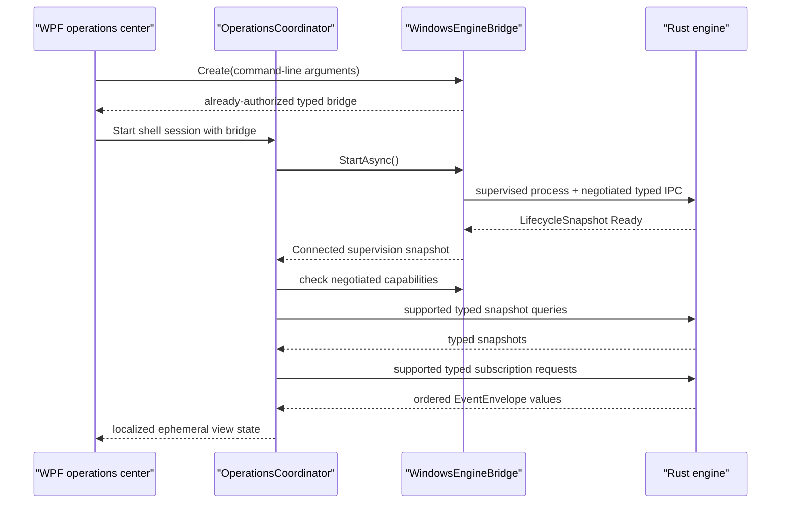

# Extend the Windows operations shell safely

The Windows WPF application is an Arabic-first presentation adapter over the supervised Rust engine. Its landing surface is **لوحة التحكم**. It shows typed lifecycle, health, readiness, configuration, synchronization, update, background-job, notification, and error projections without becoming an authority for any of them.

## Ownership and non-goals

| Concern | Authority and path |
| --- | --- |
| Commands, queries, subscriptions, events, versions, and errors | Rust `crates/contracts`; generated C# types linked by `Eitmad.Platform.Windows` |
| Domain validation, ReBAC, audit, storage, sync, update policy, jobs, notifications, and secrets | Owning Rust vertical |
| Named-pipe framing and typed contract serialization | `platform-adapters/windows/LocalIpc` |
| Engine path and runtime selection, private launch bootstrap, Job Object containment, retry, IPC reconnect, and subscription reattachment | `platform-adapters/windows/Shell` and `platform-adapters/windows/ProcessSupervision` |
| Arabic presentation, RTL layout, view state, navigation, tray, and accessibility | `shells/windows` |

The shell has no database client, configuration file writer, domain validator, permission decision, sync algorithm, update policy, secret reader, or external API client. `shells/windows/tests` scans production C# source for these ownership violations. Add new product behavior to its Rust vertical, then expose a versioned typed contract.

The furniture operations dashboard currently marks itself **وضع المعاينة**. Its sales, quotation, product, material, work-order, and department values are visual fixtures that define layout and Arabic copy only. They are not live records, they do not authorize an action, and they must not be treated as saved or synchronized state. Replace each fixture with a Rust-owned typed query and subscription before changing the footer to a connected state. Keep state-changing controls disabled or without commands until Rust supplies validation, ReBAC, scope, audit, storage, and idempotency behavior.

Preview interactions are real WPF input behavior but remain ephemeral. Sidebar buttons update their selected style and the page heading. The selected label and vector icon are white on the walnut background. They become black while the pointer highlights the selected button, then return to white when the pointer leaves. When another item is selected, the old icon returns to the shared ink theme brush. Quick actions, notification controls, and footer links show bounded Arabic feedback. The search box clears and restores its placeholder on focus changes and reports the submitted Arabic term without querying authoritative records. **عرض سعر جديد** opens a keyboard-editable drawer, validates that a customer name is present, and then reports **الحفظ معطل في وضع المعاينة**. It does not create a command, record, audit entry, or sync item. When the quotation vertical exists, replace only this preview boundary with a typed Rust-owned command and keep the failure message until a successful authoritative result returns.

## Normal state flow



`OperationsCoordinator` starts only the bounded snapshot queries whose capabilities were negotiated. The current engine implements configuration and paged reference-marker queries plus both change subscriptions. It does not advertise sync or update capability until their runtime coordinators exist. The UI shows **غير متاحة** for those absent capabilities without sending unsupported query or subscription traffic. An optional stream that is still rejected is remembered for the current engine generation, so reconnect does not repeat the rejected request. The UI does not invent state.

Configuration and reference-marker commands are the two state-changing shell flows. The view model creates typed bodies and non-empty idempotency keys. `EngineSupervisor` creates the authorized command envelope. Rust validates scope, ReBAC permission, domain values, audit, storage, and sync behavior. The coordinator applies each successful typed command result directly instead of sending a redundant query. A change event performs one bounded refresh when another writer changes the projection. A timeout does not authorize a new idempotency key because the original command outcome can be unknown.

## Event ordering, reconnect, and resynchronization

The shell keeps one `EventOrderGate` watermark per negotiated stream. A lock makes cursor acceptance and reset atomic across the concurrent stream pumps. The gate rejects a duplicate or lower sequence from the same subscription. A replacement subscription may start again at sequence `1`; the view model then rejects semantically stale configuration revisions and older event timestamps. Equal timestamps remain valid because distinct ordered events can share the same timestamp.

`EngineSupervisor` owns same-generation reconnect and reattaches every desired subscription from its last acknowledged cursor. The coordinator does not create duplicate subscriptions when `IpcHealth` returns to `Connected`. It refreshes query-backed snapshots after every connection restoration.

An expired or engine-generation cursor causes the supervisor to open a fresh stream and raise `ResyncRequired`. The coordinator then:

1. resets only that stream's shell ordering watermark;
2. shows **نحدّث الحالة من المصدر…**;
3. re-queries each negotiated query-backed projection;
4. clears the resynchronization banner when the refresh attempt finishes.

This process preserves Rust authority. A failed configuration query clears the prior entries and revision, displays **غير متاح**, and disables configuration submission instead of presenting stale values. Command failures are caught at the WPF command boundary and mapped to recovery state so they cannot escape through the dispatcher.

## Engine failure, tray, and shutdown

The shell maps process and channel mechanics separately. Rust `LifecycleSnapshot` remains the source for health and readiness. Windows `EngineSupervisionState` and `EngineIpcHealthState` supply launch, reconnect, and retry UX.

- **المحرك غير متاح الآن** means the channel or process is not yet usable. The shell keeps controls disabled and waits for bounded recovery.
- **نعيد الاتصال بالمحرك…** means the process remains supervised while IPC reconnects.
- **توقفت محاولات إعادة تشغيل المحرك** maps `RestartExhausted` and exposes one explicit new-session action.
- **تعذر استعادة الاتصال بالمحرك** maps `ReconnectExhausted`; restarting through normal supervision is the safe recovery.

Closing the main window hides it and keeps the supervised engine available through the Arabic tray menu. **إنهاء الاعتماد** starts one idempotent shutdown path: request typed engine shutdown, close the supervisor lifetime pipe, wait for Rust draining, use Job Object termination only after the 15-second deadline, dispose subscriptions and tray state, then stop WPF. An unexpected shell process exit closes the kill-on-close Job Object.

## Arabic, RTL, accessibility, and visual design

`MainWindow.xaml` sets `FlowDirection="RightToLeft"` and `Language="ar-YE"` at the window boundary. The **لوحة التحكم** navigation starts at the RTL edge. Explicit LTR grids keep the brand image, furniture photography, navigation icon columns, quotation identifiers, dates, percentages, and European numerals stable inside the RTL shell. The hidden mixed-direction conformance fixture `مرجع REF-١٢ · CNC-04 · Windows / Rust` preserves the automated boundary check without changing stored Unicode. Status always has Arabic text in addition to color.

`OperationsViewModel` maps the Rust-catalog message identifiers `eitmad.notification.sync-complete.v1` and `eitmad.notification.update-ready.v1` to Arabic notification titles. It references generated `ProtocolIds.MessageIds` constants. An unknown message identifier remains visible as its stable identifier until a cataloged translation exists; the shell must not define a new `eitmad.*` literal.

The landing dashboard uses warm walnut accents, white cards, thin neutral borders, standalone showroom photography, native Windows tray behavior, scalable WPF layout, and native UI Automation names. `MainWindow.xaml` renders a fixed `1670×939` design surface through a uniform `Viewbox`; the default `1338×753` device-independent window matches the supplied `1672×941` reference at 125% Windows display scale. `Resources/ShowroomHero.png` is a standalone photography asset generated without the reference screenshot as an input. The Arabic brand, geometric mark, text, navigation, cards, progress bars, tables, buttons, and drawer are native WPF controls and vector geometry. The reference screenshot is not packaged or rendered by the application.

`Resources/OperationsIcons.xaml` owns the dashboard icon geometry on one `24 × 24` coordinate grid. Use these vector resources instead of private-use font code points: a missing symbol font can otherwise render a blank square, and different font revisions can change the symbol shape. `OperationsTheme.xaml` supplies the shared walnut, ink, tint, and status brushes. Metric and notification icons must not introduce isolated category colors. `MainWindow.SetNavigationTone` sets selected text and `Path.Fill` to white, or black when the selected button is under the pointer. The pointer handlers apply only inside `SidebarNavigation`. Deselection clears the local icon fill so `NavVectorIcon` can restore the shared ink brush. Each sidebar navigation row uses an explicit LTR three-column layout to keep its physical geometry stable: the flexible Arabic label column comes first, a fixed `12`-unit spacer separates the content, and the fixed `34`-unit icon column stays at the right edge. The shared `NavText` style applies RTL shaping and logical-left text alignment to the label. WPF mirrors the RTL text element, so logical left renders at the physical right edge beside the spacer. `TextAlignment="Right"` renders at the physical left edge in this boundary and must not be used. The notification header uses the same LTR boundary with a fixed `12`-unit title-to-bell spacer. Its four rows use LTR columns for the left status dot, flexible RTL text, a fixed `12`-unit text-to-icon spacer, and the fixed `34`-unit icon column. The toolbar gives **عرض سعر جديد** and the search field a fixed `16`-unit separator, while the sidebar footer keeps a `20`-unit bottom margin. Keep these spacing and direction invariants when the preview fixtures become live Rust-owned projections.

Windows owns the complete non-client frame. `MainWindow.xaml` uses `WindowStyle="SingleBorderWindow"` and `ResizeMode="CanResize"`; it must not define caption-button glyphs, caption-button styles, drag handlers, or minimize, maximize, and close handlers. Windows supplies the icons, system menu, snapping, hover behavior, drag behavior, resizing, and RTL/LTR caption placement. The Arabic `RightToLeft` window places the native caption controls on the left. A left-to-right localized window lets Windows place them on the right.

The rendered app was checked at `1326×746` logical pixels on Windows. Windows UI Automation verified native **Minimize**, **Maximize**, and **Close** caption buttons. The rendered check also verified visible toolbar vectors, sidebar labels ending beside their right-edge icon columns, right-aligned notification labels, the separated **آخر عروض الأسعار** header, the fixed toolbar gap, and the sidebar footer inset. An interaction check selected **عروض الأسعار** and verified that its icon became white while the old icon returned to the ink theme color. Earlier interaction checks verified opening and closing the quotation drawer, changing the selected sidebar destination to **المنتجات**, and entering the synthetic Arabic search term **مطبخ بلوط**. The shell tests verify Windows-owned chrome, native interaction handlers, selected sidebar hover contrast, repository-owned icon resources, absence of font-code glyph dependencies and the reference screenshot, physical sidebar column isolation with shared Arabic label alignment, explicit RTL layout markers, Arabic and English fixture isolation, Arabic state mapping, empty states, and ownership boundaries. Full keyboard traversal, Arabic screen-reader announcements, high contrast, narrow-window scaling, and 200% text scaling need verification before a production installer release.

The work-distribution header uses a local RTL stack with logical-left text alignment, so **توزيع الأعمال** and its subtitle end at the card’s physical right edge. Work-distribution rows follow the same physical LTR boundary: percentage in a fixed `38`-unit column, label and progress bar in the flexible column, a fixed `12`-unit spacer, and the icon in a fixed `38`-unit right column. Each Arabic row label uses a local RTL text element with logical-left alignment so its glyphs end at the physical right edge beside the progress bar and spacer; each progress bar remains explicitly LTR.

The search field keeps its local RTL direction with logical-left text alignment so Arabic placeholder and query text end beside the search icon.

## Security and compatibility

The shell is an untrusted client. It does not resolve the engine installation, select runtime storage, construct `EngineLaunchRequest`, or grant itself permissions. `platform-adapters/windows/Shell/WindowsEngineBridge.cs` owns these Windows launch concerns and gives the shell a typed bridge. The adapter supplies only an ephemeral process bootstrap token. Rust loads and verifies the stable installation principal, tenant, scope, and owner relationship, then returns the authorization context.

The Windows adapter negotiates protocol `1.0–1.6` and uses generated current bindings. It advertises local IPC, authorization scope, config, permissions, and reference-marker capabilities plus schema `eitmad.schema.reference-marker.v1`. The supervisor exposes only the negotiated capability intersection to the shell. A missing required capability or schema range rejects the affected session. An absent optional capability changes only its panel to **غير متاحة**; it does not change engine health. Error and message identifiers are presentation inputs, not English prose to parse. Do not expose bootstrap tokens, raw frames, authorization graphs, runtime paths, or customer data in the UI or logs.

## Tests and safe extension points

Run the shell behavior suite:

```powershell
dotnet run --project shells/windows/tests/Eitmad.WindowsShell.Tests.csproj
```

Run the real engine boundary suite:

```powershell
cargo build -p eitmad-engine-cli
dotnet run --project platform-adapters/windows/tests/Eitmad.Platform.Windows.Tests.csproj -- --engine target/debug/eitmad-engine-cli.exe
```

Run the shell with the built engine:

```powershell
dotnet run --project shells/windows/Eitmad.WindowsShell.csproj -- --engine target/debug/eitmad-engine-cli.exe
```

Add Arabic copy and presentation mapping inside `Features/Operations`. Register every stable message identifier in the Rust contract catalog, regenerate `ProtocolIds`, and reference that generated constant from the mapping. Add shell-only Windows UI mechanics inside `Platform`; add launch, runtime, identity handoff, and process mechanics to the platform adapter. Add contract payloads, validation, authorization, audit, persistence, sync, and update behavior to the owning Rust vertical. Keep generated files under `shells/windows/generated` mechanically derived and excluded from shell compilation because the adapter assembly already links them.

For related boundaries, see the [reference-marker vertical](reference-marker.md), [typed local IPC](local-ipc.md), [Windows process supervision](windows-process-supervision.md), [Arabic-first UX](../../architecture/arabic-first-ux.md), and [Windows shell recovery](../../troubleshooting/windows-shell-state-recovery.md).
