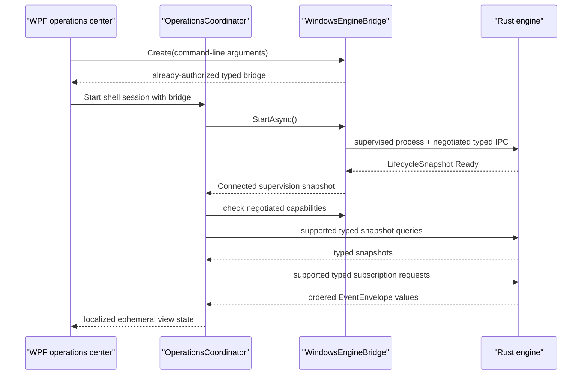

# Extend the Windows operations shell safely

The Windows WPF application is an Arabic-first presentation adapter over the supervised Rust engine. Its landing surface is **لوحة التحكم**. It shows typed lifecycle, health, readiness, configuration, synchronization, update, background-job, notification, and error projections without becoming an authority for any of them.

## Ownership and non-goals

| Concern | Authority and path |
| --- | --- |
| Commands, queries, subscriptions, events, versions, and errors | Rust `crates/contracts`; generated C# types linked by `Eitmad.Platform.Windows` |
| Domain validation, ReBAC, audit, storage, sync, update policy, jobs, notifications, and secrets | Owning Rust vertical |
| Named-pipe framing and typed contract serialization | `platform-adapters/windows/LocalIpc` |
| Engine path and runtime selection, private launch bootstrap, Job Object containment, retry, IPC reconnect, and subscription reattachment | `platform-adapters/windows/Shell` and `platform-adapters/windows/ProcessSupervision` |
| Arabic presentation, RTL layout, view state, navigation, tray, and accessibility | `shells/windows` |

The shell has no database client, configuration file writer, domain validator, permission decision, sync algorithm, update policy, secret reader, or external API client. `scripts/ci/check_repository_policy.py` scans shell source for these ownership violations; the Windows shell test project verifies presentation and adapter behavior. Add new product behavior to its Rust vertical, then expose a versioned typed contract.

The furniture operations dashboard currently marks itself **وضع المعاينة**. Its sales, quotation, product, material, work-order, and department values are visual fixtures that define layout and Arabic copy only. They are not live records, they do not authorize an action, and they must not be treated as saved or synchronized state. Replace each fixture with a Rust-owned typed query and subscription before changing the footer to a connected state. Keep state-changing controls disabled or without commands until Rust supplies validation, ReBAC, scope, audit, storage, and idempotency behavior.

`ObservableObject` at the shell root provides property notifications for presentation models. `PreviewText` provides the shared Arabic search and numeric input normalization used by synthetic preview features. Search removes combining marks and tatweel, folds alef variants including `ٱ`, and matches `ى` and `ة` consistently across preview pages. It does not rewrite stored text. Production search and validation remain Rust-owned.

Preview interactions are real WPF input behavior but remain ephemeral. Sidebar buttons update their selected style and the page heading. The selected label and vector icon stay white on the walnut background, including while the pointer highlights the selected button. When another item is selected, the old icon returns to the shared ink theme brush. Quick actions, notification controls, and footer links show bounded Arabic feedback. The shared search input draws a placeholder only while its text is empty. Focus does not change query text. Dashboard search reports the submitted Arabic term without querying authoritative records. **عرض سعر جديد** opens a keyboard-editable drawer, validates that a customer name is present, and then reports **الحفظ معطل في وضع المعاينة**. It does not create a command, record, audit entry, or sync item. When the quotation vertical exists, replace only this preview boundary with a typed Rust-owned command and keep the failure message until a successful authoritative result returns.

The **المواد الخام** destination is a dedicated preview page under `Features/RawMaterials`. `RawMaterialsViewModel` owns only transient search, category and status filters, editor state, synthetic list fixtures, and in-memory category and unit reference options. Search updates on each text change and normalizes Arabic alef variants, `ى`, `ة`, tatweel, and combining marks in both the query and searchable fields. For example, **اخشاب** matches **أخشاب طبيعية**. Filters compose, archived rows remain available with inactive styling, and the compact menu offers **تعديل**, **تكرار**, and **أرشفة** without a permanent delete action. Selecting a row, or pressing Enter or Space on a selected row, opens its editor. The **تعديل** row-menu action opens the same editor.

The category and unit selectors keep the manager inside the material editor. Their popup footers expose **+ إضافة تصنيف جديد** or **+ إضافة وحدة جديدة** plus **إدارة التصنيفات** or **إدارة الوحدات**. Saving a valid new reference closes the small editor, adds it to the active selector collection, and selects it on the material form. Unit references require both a name and short name. `RawMaterialReferenceOption` keeps the display label, archive state, and manager status observable. The shared manager can edit an existing reference or archive it. Archive never removes the reference record; it removes the option from the active material selector and moves the current selection to the first active option when required. Existing synthetic material rows keep their archived reference text. Editing a reference updates matching synthetic rows and the active form value. Duplicate names are rejected within the local reference type.

The **الأجزاء** destination is a dedicated preview page under `Features/Parts`. `PartsViewModel` owns transient search, category and status filters, a guided **المعلومات** → **المواد الخام** → **المراجعة** editor, and synthetic part and material fixtures. `PartMaterialUsage` calculates selected-material row costs and the projected part total; `PartListItem` projects list cost, usage, and status values. The mixed-direction fixture **Wardrobe Side Panel** displays `9,450 YER` and `3 Products`. Search updates on each text change and uses the same Arabic normalization policy as raw materials. Filters compose, archived rows remain visible with inactive styling, and the compact menu offers **تعديل**, **تكرار**, and **أرشفة** without permanent deletion. Selecting a row, or pressing Enter or Space on a selected row, opens the same editor as **تعديل**. The row menu uses mouse-point placement to keep its popup inside the window at the physical left edge. Add, edit, duplicate, and archive remain in-memory preview actions. See the dedicated [Parts list vertical](parts.md) page for ownership, failure recovery, and safe extension details.

The **الأثاث** destination is a dedicated manager preview under `Features/Furniture`. Its compact table uses small vector thumbnails for identification, not the receptionist catalog card pattern. `FurnitureViewModel` owns transient search and filters plus the implemented **المعلومات** → **الأجزاء** → **المقاسات** → **الخيارات** → **التسعير** → **المراجعة** flow. Product-image selection remains an in-memory shell preview. The Parts step follows the existing Parts-to-Raw-Materials picker and quantity pattern. The Variants step keeps manager-defined fixed sizes visible together, Options presents color rows and handle tiles with visible price adjustments and active states, Pricing keeps cost, selling price, and absolute margin visible for every variant, and Review presents one read-only product summary. **حفظ كمسودة** and **حفظ ونشر** only update transient preview state and return to the Furniture list. All totals, calculated costs, prices, margins, option adjustments, duplicate, archive, and editor changes are synthetic presentation state. See the dedicated [Furniture manager flow](furniture.md) page before extending it.

The manager capabilities have independent subsystem pages: [Quick Pricing](pricing.md), [Quotation review](quotations.md), [Order review](orders.md), and [Work order review](work-orders.md). Each page is the canonical guide for its view model, workflow, tests, preview boundary, and future Rust vertical. [Ready-made Products](products.md) remains the corresponding guide for the product manager.

Material, category, and unit create, edit, and archive actions change only the in-memory preview. Closing the app discards them. The shell does not define a material/reference contract, validate durable domain state, authorize a manager, create an audit record, write storage, or enqueue synchronization. A production implementation must add stable reference identifiers, validation, manager permission, organization scope, audit, persistence, idempotency, and sync behavior to a Rust raw-material vertical before the shell can claim that any value was saved.

## Normal state flow



`OperationsCoordinator` starts only the bounded snapshot queries whose capabilities were negotiated. The current engine implements configuration and paged reference-marker queries plus both change subscriptions. It does not advertise sync or update capability until their runtime coordinators exist. The UI shows **غير متاحة** for those absent capabilities without sending unsupported query or subscription traffic. An optional stream that is still rejected is remembered for the current engine generation, so reconnect does not repeat the rejected request. The UI does not invent state.

Configuration and reference-marker commands are the two state-changing shell flows. The view model creates typed bodies and non-empty idempotency keys. `EngineSupervisor` creates the authorized command envelope. Rust validates scope, ReBAC permission, domain values, audit, storage, and sync behavior. The coordinator applies each successful typed command result directly instead of sending a redundant query. A change event performs one bounded refresh when another writer changes the projection. A timeout does not authorize a new idempotency key because the original command outcome can be unknown.

## Event ordering, reconnect, and resynchronization

The shell keeps one `EventOrderGate` watermark per negotiated stream. A lock makes cursor acceptance and reset atomic across the concurrent stream pumps. The gate rejects a duplicate or lower sequence from the same subscription. A replacement subscription may start again at sequence `1`; the view model then rejects semantically stale configuration revisions and older event timestamps. Equal timestamps remain valid because distinct ordered events can share the same timestamp.

`EngineSupervisor` owns same-generation reconnect and reattaches every desired subscription from its last acknowledged cursor. The coordinator does not create duplicate subscriptions when `IpcHealth` returns to `Connected`. It refreshes query-backed snapshots after every connection restoration.

An expired or engine-generation cursor causes the supervisor to open a fresh stream and raise `ResyncRequired`. The coordinator then:

1. resets only that stream's shell ordering watermark;
2. shows **نحدّث الحالة من المصدر…**;
3. re-queries each negotiated query-backed projection;
4. clears the resynchronization banner when the refresh attempt finishes.

This process preserves Rust authority. A failed configuration query clears the prior entries and revision, displays **غير متاح**, and disables configuration submission instead of presenting stale values. Command failures are caught at the WPF command boundary and mapped to recovery state so they cannot escape through the dispatcher.

## Engine failure, tray, and shutdown

The shell maps process and channel mechanics separately. Rust `LifecycleSnapshot` remains the source for health and readiness. Windows `EngineSupervisionState` and `EngineIpcHealthState` supply launch, reconnect, and retry UX.

- **المحرك غير متاح الآن** means the channel or process is not yet usable. The shell keeps controls disabled and waits for bounded recovery.
- **نعيد الاتصال بالمحرك…** means the process remains supervised while IPC reconnects.
- **توقفت محاولات إعادة تشغيل المحرك** maps `RestartExhausted` and exposes one explicit new-session action.
- **تعذر استعادة الاتصال بالمحرك** maps `ReconnectExhausted`; restarting through normal supervision is the safe recovery.

Closing the main window hides it and keeps the supervised engine available through the Arabic tray menu. **إنهاء الاعتماد** starts one idempotent shutdown path: request typed engine shutdown, close the supervisor lifetime pipe, wait for Rust draining, use Job Object termination only after the 15-second deadline, dispose subscriptions and tray state, then stop WPF. An unexpected shell process exit closes the kill-on-close Job Object.

## Arabic, RTL, accessibility, and visual design

`MainWindow.xaml` sets `FlowDirection="RightToLeft"` and `Language="ar-YE"` at the window boundary. Repository policy and shell tests enforce these metadata markers without requiring visible locale copy. The brand header shows only the product name and descriptor; it does not expose locale labels or machine locale codes. The brand text area fills its header column, and each line is explicitly anchored at the physical right edge so different line lengths share one right boundary; under its RTL coordinate frame this uses `HorizontalAlignment="Left"` with right text alignment. The **لوحة التحكم** navigation starts at the RTL edge. Explicit LTR grids keep the brand image, furniture photography, navigation icon columns, quotation identifiers, dates, percentages, and European numerals stable inside the RTL shell. The hidden mixed-direction conformance fixture `مرجع REF-١٢ · CNC-04 · Windows / Rust` preserves the automated boundary check without changing stored Unicode. Status always has Arabic text in addition to color.

`OperationsViewModel` maps the Rust-catalog message identifiers `eitmad.notification.sync-complete.v1` and `eitmad.notification.update-ready.v1` to Arabic notification titles. It references generated `ProtocolIds.MessageIds` constants. An unknown message identifier remains visible as its stable identifier until a cataloged translation exists; the shell must not define a new `eitmad.*` literal.

The landing dashboard uses warm walnut accents, white cards, thin neutral borders, standalone showroom photography, native Windows tray behavior, responsive WPF layout, and native UI Automation names. It does not put the page inside a fixed root `Viewbox`: whole-page uniform scaling preserves one aspect ratio, prevents content reflow, shrinks text, and leaves unused bands when the window ratio changes. `MainWindow.xaml` instead uses `Grid` star/auto sizing, `UniformGrid` section reflow, and an auto vertical `ScrollViewer`. `Resources/ShowroomHero.png` is a standalone photography asset generated without the reference screenshot as an input. The Arabic brand, geometric mark, text, navigation, cards, progress bars, tables, buttons, and drawer are native WPF controls and vector geometry. The reference screenshot is not packaged or rendered by the application.

`RawMaterialsView.xaml` extends the same walnut and neutral system with explicit WPF templates for every selector, text editor, and row-action popup. The page header uses an LTR geometry grid with an RTL text stack anchored to the physical right edge; its title and descriptor share that right boundary. The list starts directly with its filters and does not render a separate preview notification banner; the editor keeps its local-data status label. Material costs use the Arabic Saudi Riyal abbreviation `ر.س.` as a prefix (`ر.س. 25,000`). `RawMaterialListItem` formats the numeric amount with `InvariantCulture` so Latin digits, comma grouping, and scenario results do not depend on the machine culture. Cost cells render the currency and numeric amount as separate siblings inside an LTR container, so bidi shaping cannot move the number ahead of the currency in the RTL shell. This display rule is also applied to dashboard and quotation fixtures.

## Reuse native controls on a new page

`shells/windows/Resources/OperationsControls.xaml` owns the reusable input, selector, menu, and label styles. `shells/windows/Resources/OperationsTheme.xaml` owns theme colors, cards, navigation, and the common action-button template. Both the application and rendered test host load the theme, icons, then controls. Use these resources directly; keep only feature-specific state triggers and footer content in page resources.

| Purpose | Shared resource |
| --- | --- |
| Editor input, multiline notes, numeric text | `TextInput` |
| Dashboard, list, and picker search | `SearchInput` |
| Filter or editor selector | `SelectInput`, `SelectItem` |
| Form label, table heading, table value | `FormField`, `OperationsTable`, `TableBody` |
| Detail labels and values | `MetadataLabel`, `MetadataValue`, `SummaryLabel`, `SummaryValue` |
| Main, secondary, compact, and inline actions | `PrimaryButton`, `SecondaryButton`, `CompactButton`, `InlineActionButton` |
| Icon, row, and selector-footer actions | `IconButton`, `RowActionButton`, `DropdownActionButton` |
| Flat row menu and separator | `ActionMenu`, `ActionMenuItem`, `ActionMenuSeparator` |
| Status appearance and native radio choice | `StatusBadge`, `ChoiceRadio` |

`shells/windows/Controls/ControlOptions.cs` supplies optional presentation parameters. `Icon` accepts a shared geometry or null. `Placeholder` is display text, never input data. `ShowText` controls button content visibility without changing its command, tooltip, or accessible name. `CornerRadius` controls input, selector, and button corners. Keep `ToolTip`, `ToolTipService.IsEnabled`, `Content`, `IsEnabled`, `IsReadOnly`, `Command`, and bindings on the native WPF control. Give icon-only actions an explicit Arabic `AutomationProperties.Name` and tooltip. Set `ShowText` from a style trigger when a compact layout must hide a label.

Inputs have a 44-DIP minimum height and grow with content. Use `AcceptsReturn`, `TextWrapping`, `VerticalContentAlignment`, and scrollbar properties for notes; isolate numeric and technical text with a local LTR boundary. `SearchInput` defaults its placeholder to its Arabic automation name; override it with `ControlOptions.Placeholder`, or use an empty string to hide it. Buttons forward foreground color to generated text and icons, including keyboard-focus and disabled states. Inputs and buttons use Windows system color resources in high contrast. `ControlOptions.HighContrast` is a template implementation property bound to the Windows resource; pages should not set it.

`SelectInput` uses the Materials selector's rounded surface, copper chevron, focus border, bounded scrolling, and popup. Native `ItemsSource`, `SelectedItem`, `SelectedValuePath`, `DisplayMemberPath`, `ItemTemplate`, `IsEditable`, `IsReadOnly`, and `MaxDropDownHeight` remain available. `ControlOptions.FooterTemplate` optionally adds a data template below the options. Its data context is the owning `ComboBox`; feature footer handlers can close that selector and open their existing editor. Materials supplies category/unit actions; Products supplies category actions. Selectors without a footer template show only options. Keep record behavior and reference management in the owning feature.

`shells/windows/Layout/AdaptiveFieldsPanel.cs` arranges filter fields into equal columns according to available width. `MinItemWidth` is the preferred field width; `Spacing` separates columns and rows. Rows grow to the tallest field, and collapsed children use no space. At widths below one preferred column, the remaining column fits the available width. Use it when equal fields match the established screen geometry. Orders, Quotations, Work Orders, Pricing, and Products retain their deliberate wide-search and narrow-filter proportions with native wrap or grid layout. Furniture keeps horizontal scrolling around its table, and Pricing scrolls its header and rows together.

For example, declare the `layout`, `controls`, and `automation` namespaces as the existing pages do, then compose native controls:

```xml
<layout:AdaptiveFieldsPanel MinItemWidth="220" Spacing="12">
    <TextBox automation:AutomationProperties.Name="البحث عن جزء">
        <TextBox.Style><StaticResource ResourceKey="SearchInput" /></TextBox.Style>
        <TextBox.Text><Binding Path="SearchText" UpdateSourceTrigger="PropertyChanged" /></TextBox.Text>
    </TextBox>
    <ComboBox automation:AutomationProperties.Name="تصفية الفئة">
        <ComboBox.Style><StaticResource ResourceKey="SelectInput" /></ComboBox.Style>
        <ComboBox.ItemsSource><Binding Path="CategoryOptions" /></ComboBox.ItemsSource>
        <ComboBox.SelectedItem><Binding Path="SelectedCategory" /></ComboBox.SelectedItem>
    </ComboBox>
</layout:AdaptiveFieldsPanel>
```

Keep status-state mappings in their feature styles, based on `StatusSurface` and `StatusLabel`. Keep popup placement separate from text direction: row menus use physical LTR placement and Arabic menu items use RTL shaping. The shared row menus currently contain flat actions; they do not define submenu or checkable-item templates.

The focused `SharedControlsRenderedTests` cover all eight list search bindings and filter bounds at normal and compact widths, selector footer ownership and editor focus, editable selector text, optional button text, larger input text, and system-color template states. Existing rendered feature tests cover navigation, editing, row menus, and preview behavior. For optional synthetic review images, set `EITMAD_UI_CAPTURE_DIR` to a local output directory before running the focused tests. These checks do not certify a production release or replace full Windows high-contrast, text-scaling, and screen-reader verification.

## Responsive shell layout

`Layout/ResponsiveLayout.cs` is the shared shell presentation policy for this page and future WPF pages. A page root opts in with `layout:ResponsiveLayout.IsEnabled="True"`. The attached property observes device-independent width, publishes the inherited `ResponsiveLayoutMode`, and lets child styles respond without page-specific resize handlers. `Compact` applies below `900` DIPs, `Standard` applies from `900` through `1599` DIPs, and `Wide` starts at `1600` DIPs. Keep base values that a breakpoint must replace inside style setters. A local XAML value has higher WPF precedence and will block a data-trigger setter.

At compact width, the sidebar becomes a `78`-DIP icon rail, keeps every navigation action and its Arabic tooltip/tag, and moves the search field below the primary toolbar row. The new-quotation action keeps its plus icon and hides only its label. The hero image hides while the Arabic greeting remains. Metrics use two columns, quick actions use two columns, and the quotation, notification, and work-distribution cards occupy separate full-width rows. At standard width, the full sidebar returns, metrics use two columns, quick actions use three columns, the quotation table occupies a full row, and the two lower cards share the next row. Wide mode restores four metric columns and six quick actions for an ultra-wide surface. Short windows scroll the dashboard content and sidebar independently. Text, icons, and hit targets do not scale with the window ratio.

`Resources/OperationsIcons.xaml` owns the dashboard icon geometry on one `24 × 24` coordinate grid. Use these vector resources instead of private-use font code points: a missing symbol font can otherwise render a blank square, and different font revisions can change the symbol shape. `OperationsTheme.xaml` supplies the shared walnut, ink, tint, and status brushes. Metric and notification icons must not introduce isolated category colors. `MainWindow.SetNavigationTone` applies the theme-owned `NavSelectedBrush` as a local background value and keeps selected text and `Path.Fill` white. `NavButton` places a translucent walnut `HoverShade` between the background and content. Its `MouseOver` visual state reveals that layer with a short transition, so unselected rows become warm and selected rows become darker without tinting their labels or icons. Deselection clears the local background and content values so the shared theme styles become authoritative again. Each sidebar navigation row uses an explicit LTR three-column layout to keep its physical geometry stable: the flexible Arabic label column comes first, a fixed `12`-unit spacer separates the content, and the fixed `34`-unit icon column stays at the right edge. The shared `NavText` style applies RTL shaping, right text alignment, physical right anchoring, and no wrapping so every label ends at the sidebar's right text boundary beside the spacer and icon. `NavButton` derives both its tooltip and UI Automation name from its Arabic `Tag`, so compact icons keep a visible and accessible label. The notification header uses the same LTR boundary with a fixed `12`-unit title-to-bell spacer. Its four rows use LTR columns for the left status dot, flexible RTL text, a fixed `12`-unit text-to-icon spacer, and the fixed `34`-unit icon column. The toolbar uses a `16`-unit status-action inset and a separate compact search row. Keep these spacing and direction invariants when the preview fixtures become live Rust-owned projections.

Windows owns the complete non-client frame. `MainWindow.xaml` uses `WindowStyle="SingleBorderWindow"` and `ResizeMode="CanResize"`; it must not define caption-button glyphs, caption-button styles, drag handlers, or minimize, maximize, and close handlers. Windows supplies the icons, system menu, snapping, hover behavior, drag behavior, resizing, and RTL/LTR caption placement. The Arabic `RightToLeft` window places the native caption controls on the left. A left-to-right localized window lets Windows place them on the right.

The standard MSTest project separates public presentation behavior from instantiated WPF behavior. The rendered tests create the real `MainWindow` on an STA dispatcher at `1338×753` and `780×745`. They verify resolved Arabic RTL metadata, Windows-owned chrome, navigation, preview focus transfer after dispatcher work, selected-navigation contrast, standard and compact reflow, accessible Arabic control names, create-page focus transfer after dispatcher work, raw-material and Parts row-menu placement, the Pricing modal's focus, validation, save, and cancel behavior, the Quotations list-to-detail focus path with conditional discount actions, the Orders list-to-read-only-detail path, and the Work orders list-to-detail status path at standard and compact sizes. Pure tests verify operations mapping and lifecycle behavior, exact breakpoint boundaries, Arabic and English filtering, deterministic mixed-direction amounts, non-destructive preview actions, inline reference management, Arabic-numeral price input, quotation filter composition, computed quotation totals, approval gating, order filter composition and totals, and Work order filters and preview status transitions without showing a window. Repository ownership prohibitions remain in `scripts/ci/check_repository_policy.py`; the C# suite does not read production `.cs` or `.xaml` files. Full keyboard traversal, Arabic screen-reader announcements, high contrast, and 200% text scaling still need verification before a production installer release.

The work-distribution header uses a local RTL stack with logical-left text alignment, so **توزيع الأعمال** and its subtitle end at the card’s physical right edge. Work-distribution rows follow the same physical LTR boundary: percentage in a fixed `38`-unit column, label and progress bar in the flexible column, a fixed `12`-unit spacer, and the icon in a fixed `38`-unit right column. Each Arabic row label uses a local RTL text element with logical-left alignment so its glyphs end at the physical right edge beside the progress bar and spacer; each progress bar remains explicitly LTR.

The search field keeps its local RTL direction with logical-left text alignment so Arabic placeholder and query text end beside the search icon.

The latest quotations header keeps its title in the RTL text boundary with logical-left alignment, so **آخر عروض الأسعار** ends at the card’s physical right edge while **عرض الكل** remains in its separate action column.

The top toolbar uses four physical LTR columns for the new-quotation action, status actions, flexible search, and content-sized dashboard title. In compact mode, the search border moves to a second row and spans all four columns. The dashboard title remains at the Arabic reading edge, and the action label hides while its icon and tooltip remain available. The search text keeps its local RTL boundary inside this physical LTR arrangement.

The work-distribution footer link sets `HorizontalContentAlignment="Left"` locally so it starts at the same physical left edge as the notification footer link, despite the shared `LinkButton` style defaulting to right-aligned content.

## Security and compatibility

The shell is an untrusted client. It does not resolve the engine installation, select runtime storage, construct `EngineLaunchRequest`, or grant itself permissions. `platform-adapters/windows/Shell/WindowsEngineBridge.cs` owns these Windows launch concerns and gives the shell a typed bridge. The adapter supplies only an ephemeral process bootstrap token. Rust loads and verifies the stable installation principal, tenant, scope, and owner relationship, then returns the authorization context.

The Windows adapter negotiates protocol `1.0–1.6` and uses generated current bindings. It advertises local IPC, authorization scope, config, permissions, and reference-marker capabilities plus schema `eitmad.schema.reference-marker.v1`. The supervisor exposes only the negotiated capability intersection to the shell. A missing required capability or schema range rejects the affected session. An absent optional capability changes only its panel to **غير متاحة**; it does not change engine health. Error and message identifiers are presentation inputs, not English prose to parse. Do not expose bootstrap tokens, raw frames, authorization graphs, runtime paths, or customer data in the UI or logs.

## Tests and safe extension points

Run the shell behavior suite:

```powershell
dotnet test shells/windows/tests/Eitmad.WindowsShell.Tests.csproj --configuration Release --nologo
```

Run the real engine boundary suite:

```powershell
cargo build -p eitmad-engine-cli
dotnet run --project platform-adapters/windows/tests/Eitmad.Platform.Windows.Tests.csproj -- --engine target/debug/eitmad-engine-cli.exe
```

Run the shell with the built engine:

```powershell
dotnet run --project shells/windows/Eitmad.WindowsShell.csproj -- --engine target/debug/eitmad-engine-cli.exe
```

Add operations copy and projection mapping inside `Features/Operations`; add raw-material list presentation state inside `Features/RawMaterials`; add Parts list presentation state inside `Features/Parts`; add Furniture list and editor presentation state inside `Features/Furniture`; add quick-pricing presentation state inside `Features/Pricing`; add quotation review presentation state inside `Features/Quotations`; add manager order review presentation state inside `Features/Orders`; add manager Work order presentation state inside `Features/WorkOrders`. Register every stable message identifier in the Rust contract catalog, regenerate `ProtocolIds`, and reference that generated constant from the mapping. Add shell-only Windows UI mechanics inside `Platform`; add launch, runtime, identity handoff, and process mechanics to the platform adapter. Add contract payloads, validation, authorization, audit, persistence, sync, and update behavior to the owning Rust vertical. Keep generated files under `shells/windows/generated` mechanically derived and excluded from shell compilation because the adapter assembly already links them.

For related boundaries, see the [reference-marker vertical](reference-marker.md), [typed local IPC](local-ipc.md), [Windows process supervision](windows-process-supervision.md), [Arabic-first UX](../../architecture/arabic-first-ux.md), and [Windows shell recovery](../../troubleshooting/windows-shell-state-recovery.md).


## Compose shared presentation controls

The shell owns `PageHeader`, `EmptyState`, `FeedbackNotice`, `StatusBadge`, `AmountDisplay`, and `StepIndicator` in `shells/windows/Controls`. Templates live in `OperationsControls.xaml`. These controls do not validate domain data or change preview state.

| Control | Parameters |
| --- | --- |
| `PageHeader` | `Title`, `Subtitle`, optional `Icon`, `BackAction`, and action `Content`; actions wrap below the heading. `HeadingMinWidth` defaults to 260 DIPs; the dashboard title uses zero inside its existing toolbar. |
| `EmptyState` | `Heading`, `Description`, optional `Icon` and action `Content`, `IsCompact`. |
| `FeedbackNotice` | `Message`, `Tone`, `IsFloating`, `CanDismiss`, `DisplayDuration`, and `Dismissed`. Zero duration is persistent. |
| `StatusBadge` | `Text`, `Tone`, optional `Icon`, and `IsCompact`. Feature styles supply tone. |
| `AmountDisplay` | Preformatted `AmountText`, `UnitText`, `UnitPlacement` (`Before` or `After`), and `EmptyText`. No parsing or calculation. |
| `StepIndicator` | `ItemsSource` accepts a string array or list of step names (use `ObservableCollection<string>` for live changes). Count, equal widths, and one-based numbers are automatic. Optional one-based `CurrentStep` defaults to 1. Steps do not accept clicks; state is exposed through Arabic automation names. |

`PresentationTone` has `Neutral`, `Information`, `Success`, `Warning`, and `Danger`. Use the Arabic status label as well as color. A notice stops its timer when unloaded. The feature handles `Dismissed` with its existing clear-feedback action. Call `RestartDuration()` when repeating an identical message. Existing callers retain their 2.5-second or 3-second duration.

```xml
<controls:AmountDisplay AmountText="9,450"
                        UnitText="YER" UnitPlacement="After" />
<controls:StatusBadge Text="نشط" Tone="Success" />
```

The first composition checkpoint passed the shell build without warnings and 36 focused presentation/shared-control tests. Synthetic captures were inspected at normal and compact widths. Full Windows high-contrast mode and OS text scaling were not inspected at this checkpoint; template tests are not a substitute for those checks.


## Associate form labels with native inputs

`FormField` accepts `Label`, input `Content`, optional `HelpText`, `ErrorText`, `IsRequired`, and `LabelTarget`. The template wraps long help and error text. Set `LabelTarget` for a compound field with more than one input; otherwise the control associates its label with the first native input. It releases the previous accessibility association when content changes or unloads. Existing input names, Arabic accessible names, binding update timing, and validation remain owned by the feature.

```xml
<controls:FormField Label="اسم المادة" IsRequired="True"
                    HelpText="أدخل الاسم كما سيظهر في القائمة">
    <TextBox Style="&#123;StaticResource TextInput&#125;" />
</controls:FormField>
```

The field checkpoint passed 20 focused rendered checks, including label replacement, unchanged binding timing, feature editor entry, and existing editor actions. Synthetic editor captures were inspected at normal and compact widths. Existing Furniture editor horizontal overflow remains outside the field layout change. Windows OS text scaling and full high-contrast mode remain unverified.


## Host centered dialogs

`DialogHost` owns the 11 centered overlays. Bind `IsOpen`, `Title`, body `Content`, footer `Footer`, and `PreferredWidth`. Set `InitialFocusTarget` to the editor input. Handle `CloseRequested`, or supply `CloseCommand` and `CloseCommandParameter`, using the same feature action as Cancel. A close request does not change `IsOpen`; validation and transitions remain in the feature.

The host keeps a 24-DIP viewport inset, scrolls the body, and keeps the title and footer available. It traps keyboard focus and blocks background pointer and key input. Backdrop clicks do nothing. An open selector consumes Escape first; the next Escape requests Cancel. Enter does not confirm an action automatically. Closing restores the invoking control when available, then the reopened dialog's initial target, then an available window focus target. The dashboard drawer retains its separate presentation.

```xml
<controls:DialogHost Title="تعديل السعر" PreferredWidth="440">
    <controls:DialogHost.Footer>
        <Button Content="إلغاء" />
    </controls:DialogHost.Footer>
    <controls:FormField Label="سعر البيع"><TextBox /></controls:FormField>
</controls:DialogHost>
```

The dialog checkpoint passed 21 focused rendered checks. Tests cover focus entry and cycle, pointer blocking, selector Escape, close requests, focus return, viewport limits, and real Products and Raw materials manager/editor transitions with failed validation. All 11 synthetic dialogs were inspected at both normal and compact widths. These checks do not certify screen-reader announcements or OS high-contrast mode.


## Define native operations tables

`OperationsTable` derives from WPF `DataGrid`. The dashboard and eight feature pages use 17 instances for lists, detail rows, and editor rows. Each column declares its header, width, cell template, and `SortMemberPath` once. Use typed numbers and dates for sorting, and the visible Arabic label for status sorting. Image and action columns set `CanUserSort="False"`. Headers accept keyboard focus; Space activates sorting. Activation alternates ascending and descending order on one column.

Each table owns a separate collection view with Arabic culture. It preserves initial source order until a header is activated and never sorts the source collection. `SelectedValuePath="Id"` preserves the selected record when a list rebuild replaces its object. Synchronous filter rebuilds retain selection only if the record remains visible; a later filter does not restore a previously removed selection. The table refreshes an active sort after completed record edits and defers it while an explicit input holds focus.

Selection is single-row. Record-list tables enable `IsRowInvocationEnabled` and handle `RowInvoked` to open the same edit or detail surface as their explicit action. Pointer release, Enter, and Space invoke a row; buttons, text inputs, and selectors do not. The shared style supplies the hand cursor and a calm `#FBF4EC` cell highlight, with Windows highlight colors in high contrast. Detail and editor tables leave invocation disabled. Automatic row creation, deletion, column reordering, and cell editing are disabled. Put explicit inputs in `CellTemplate` and retain their normal binding update timing. The table owns horizontal scrolling, native column resizing, and virtualized rows within bounded vertical space. Widths and sort state live only in the current view. The Furniture Parts and Colors steps give their tables the available viewport width; other Furniture editor layouts retain their existing layout.

```xml
<controls:OperationsTable MaxHeight="460" SelectedValuePath="Id"
                          IsRowInvocationEnabled="True"
                          RowInvoked="RecordRowInvoked">
    <controls:OperationsTable.EmptyContent>
        <controls:EmptyState Heading="لا توجد نتائج" IsCompact="True" />
    </controls:OperationsTable.EmptyContent>
    <DataGrid.Columns>
        <DataGridTextColumn Header="الاسم" Width="2*" MinWidth="160"
                            SortMemberPath="Name" Binding="&#123;Binding Name&#125;" />
    </DataGrid.Columns>
</controls:OperationsTable>
```

Set `ItemsSource` to the feature's existing visible collection. `EmptyContent` accepts any presentation content. Keep amount formatting in the feature; `AmountDisplay` receives complete strings and never splits formatted currency. `DashboardQuotationPreview` contains only the existing synthetic dashboard rows with typed sort values.

Focused rendered checks cover numeric/date/Arabic sorting, keyboard header activation, column alignment after resizing, isolated views, row-menu targets after sorting, selection through real filter rebuilds, and unchanged explicit editor bindings. All 17 tables have normal and compact synthetic captures. The captures exposed and resolved missing detail-status data contexts and unbounded Furniture table layout. Large text and simulated Windows system-color resources were also inspected. Actual OS high-contrast mode, OS text scaling, and screen-reader announcements remain unverified. The tests do not establish production readiness; Rust contracts, authorization, audit, storage, and preview limits are unchanged.

Run the affected presentation and rendered checks:

```powershell
dotnet test shells/windows/tests/Eitmad.WindowsShell.Tests.csproj --filter 'FullyQualifiedName~Rendered|FullyQualifiedName~PresentationTests'
```

Audit this guide with the focused documentation command in the [documentation standard](../contributing/documentation-standard.md). No Rust workspace check is needed for these shell-only controls.
