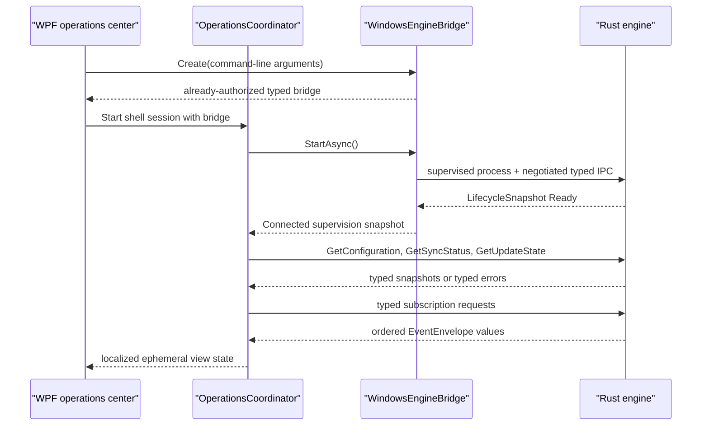

# Extend the Windows operations shell safely

The Windows WPF application is an Arabic-first presentation adapter over the supervised Rust engine. It shows typed lifecycle, health, readiness, configuration, synchronization, update, background-job, notification, and error projections without becoming an authority for any of them.

## Ownership and non-goals

| Concern | Authority and path |
| --- | --- |
| Commands, queries, subscriptions, events, versions, and errors | Rust `crates/contracts`; generated C# types linked by `Eitmad.Platform.Windows` |
| Domain validation, ReBAC, audit, storage, sync, update policy, jobs, notifications, and secrets | Owning Rust vertical |
| Named-pipe framing and typed contract serialization | `platform-adapters/windows/LocalIpc` |
| Engine path and runtime selection, development launch identity, Job Object containment, retry, IPC reconnect, and subscription reattachment | `platform-adapters/windows/Shell` and `platform-adapters/windows/ProcessSupervision` |
| Arabic presentation, RTL layout, view state, navigation, tray, and accessibility | `shells/windows` |

The shell has no database client, configuration file writer, domain validator, permission decision, sync algorithm, update policy, secret reader, or external API client. `shells/windows/tests` scans production C# source for these ownership violations. Add new product behavior to its Rust vertical, then expose a versioned typed contract.

## Normal state flow



`OperationsCoordinator` queries first on every new usable IPC session. Optional subscription failure cannot hide available snapshots. The current engine implements configuration query and configuration-change subscription. It currently returns `eitmad.error.contract-invalid.v1` for synchronization and update queries and `eitmad.error.ipc-subscription-unsupported.v1` for unsupported operational streams. The UI shows **غير متاحة** for these typed failures. It does not invent state. When the Rust vertical implements a state query or stream, the existing generated type and state mapper display it.

Configuration is the only state-changing shell flow. The view model creates `UpdateConfiguration` with the exact snapshot `ExpectedRevision`, one or more typed `ConfigChange` values, and a non-empty idempotency key. `EngineSupervisor.SubmitConfigurationPatchAsync` creates the authorized command envelope. Rust validates the language tag, ReBAC permission, scope, revision, audit record, and value. After success, the coordinator reads a new snapshot. A timeout does not authorize a new idempotency key because the original command outcome can be unknown.

## Event ordering, reconnect, and resynchronization

The shell keeps one `EventOrderGate` watermark per stream. A lock makes cursor acceptance and reset atomic across the six concurrent stream pumps. The gate rejects a duplicate or lower sequence from the same subscription. A replacement subscription may start again at sequence `1`; the view model then rejects semantically stale configuration revisions and older event timestamps. Equal timestamps remain valid because distinct ordered events can share the same timestamp.

`EngineSupervisor` owns same-generation reconnect and reattaches every desired subscription from its last acknowledged cursor. The coordinator does not create duplicate subscriptions when `IpcHealth` returns to `Connected`. It refreshes query-backed snapshots after every connection restoration.

An expired or engine-generation cursor causes the supervisor to open a fresh stream and raise `ResyncRequired`. The coordinator then:

1. resets only that stream's shell ordering watermark;
2. shows **نحدّث الحالة من المصدر…**;
3. clears ephemeral discrete job, notification, or error rows when no authoritative list query exists;
4. re-queries configuration, sync, and update snapshots for query-backed state;
5. clears the resynchronization banner when the refresh attempt finishes, including streams with no list query and failed typed queries.

This process preserves Rust authority. A failed configuration query clears the prior entries and revision, displays **غير متاح**, and disables configuration submission instead of presenting stale values. Notification and error history can be absent after an unreplayable discrete gap because the current contracts do not provide list queries. Command failures are caught at the WPF command boundary and mapped to recovery state so they cannot escape through the dispatcher.

## Engine failure, tray, and shutdown

The shell maps process and channel mechanics separately. Rust `LifecycleSnapshot` remains the source for health and readiness. Windows `EngineSupervisionState` and `EngineIpcHealthState` supply launch, reconnect, and retry UX.

- **المحرك غير متاح الآن** means the channel or process is not yet usable. The shell keeps controls disabled and waits for bounded recovery.
- **نعيد الاتصال بالمحرك…** means the process remains supervised while IPC reconnects.
- **توقفت محاولات إعادة تشغيل المحرك** maps `RestartExhausted` and exposes one explicit new-session action.
- **تعذر استعادة الاتصال بالمحرك** maps `ReconnectExhausted`; restarting through normal supervision is the safe recovery.

Closing the main window hides it and keeps the supervised engine available through the Arabic tray menu. **إنهاء الاعتماد** starts one idempotent shutdown path: request typed engine shutdown, close the supervisor lifetime pipe, wait for Rust draining, use Job Object termination only after the 15-second deadline, dispose subscriptions and tray state, then stop WPF. An unexpected shell process exit closes the kill-on-close Job Object.

## Arabic, RTL, accessibility, and visual design

`MainWindow.xaml` sets `FlowDirection="RightToLeft"` and `Language="ar-YE"` at the window boundary. The primary navigation starts at the RTL edge. Machine identifiers, configuration keys, protocol names, and mixed fixtures such as `CNC-04` and `Windows / Rust` use explicit LTR child containers. Status always has Arabic text in addition to color.

`OperationsViewModel` maps the Rust-catalog message identifiers `eitmad.notification.sync-complete.v1` and `eitmad.notification.update-ready.v1` to Arabic notification titles. It references generated `ProtocolIds.MessageIds` constants. An unknown message identifier remains visible as its stable identifier until a cataloged translation exists; the shell must not define a new `eitmad.*` literal.

The visual system uses restrained workshop colors, high-contrast status surfaces, native Windows tray behavior, scalable WPF layout, and native UI Automation names. The rendered app was checked at `1240×820` with the real Rust engine. The shell tests verify root RTL metadata, Arabic and English fixture isolation, Arabic state mapping, empty states, and ownership boundaries. Keyboard traversal, Arabic screen-reader announcements, high contrast, and 200% text scaling need verification before a production installer release.

## Security and compatibility

The shell is an untrusted client. It does not resolve the engine installation, select runtime storage, construct `EngineLaunchRequest`, or grant itself permissions. `platform-adapters/windows/Shell/WindowsEngineBridge.cs` owns these Windows launch concerns and gives the shell an already-authorized typed bridge. Development runs use an explicit synthetic organization context where `TenantId` equals the organization `ScopeRef.Id`, a random child-process bearer token, and `--allow-insecure-development-auth`. This path is not production authentication and must not ship enabled.

The Windows adapter negotiates protocol `1.0–1.5` and uses generated current bindings. A missing required capability rejects the session. Optional operational state can return a typed error without changing engine health. Error and message identifiers are presentation inputs, not English prose to parse. Do not expose bearer tokens, raw frames, authorization graphs, runtime paths, or customer data in the UI or logs.

## Tests and safe extension points

Run the shell behavior suite:

```powershell
dotnet run --project shells/windows/tests/Eitmad.WindowsShell.Tests.csproj
```

Run the real engine boundary suite:

```powershell
cargo build -p eitmad-engine-cli
dotnet run --project platform-adapters/windows/tests/Eitmad.Platform.Windows.Tests.csproj -- --engine target/debug/eitmad-engine-cli.exe
```

Run the shell with the built engine:

```powershell
dotnet run --project shells/windows/Eitmad.WindowsShell.csproj -- --engine target/debug/eitmad-engine-cli.exe
```

Add Arabic copy and presentation mapping inside `Features/Operations`. Register every stable message identifier in the Rust contract catalog, regenerate `ProtocolIds`, and reference that generated constant from the mapping. Add shell-only Windows UI mechanics inside `Platform`; add launch, runtime, identity handoff, and process mechanics to the platform adapter. Add contract payloads, validation, authorization, audit, persistence, sync, and update behavior to the owning Rust vertical. Keep generated files under `shells/windows/generated` mechanically derived and excluded from shell compilation because the adapter assembly already links them.

For related boundaries, see [typed local IPC](local-ipc.md), [Windows process supervision](windows-process-supervision.md), [Arabic-first UX](../../architecture/arabic-first-ux.md), and [Windows shell recovery](../../troubleshooting/windows-shell-state-recovery.md).
