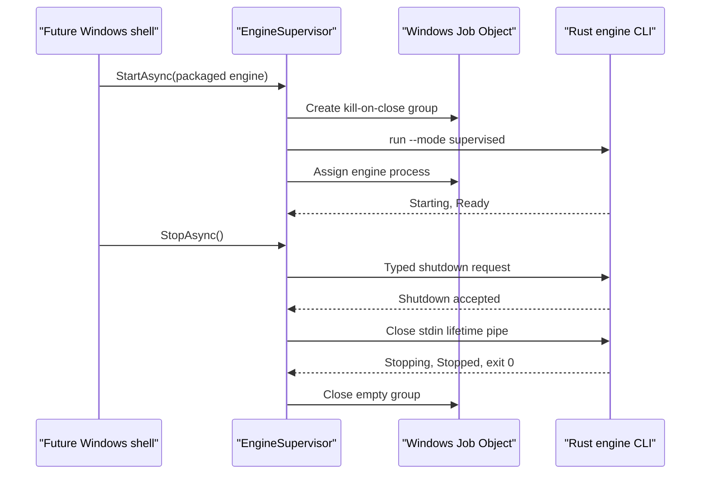

# Extend Windows engine process supervision safely

`Eitmad.Platform.Windows.ProcessSupervision` groups the Rust engine with the Windows application, recovers from bounded unexpected exits, rejects stale process observations, and drains the engine on intentional shutdown. It is platform infrastructure; it does not create a Windows UI or own product behavior.

## Ownership and boundaries

| Concern | Authority |
| --- | --- |
| Engine lifecycle, identity, structured failures, and retry safety | Rust contracts and `eitmad-engine-runtime` |
| CLI process arguments and stdin-EOF shutdown | `eitmad-engine-cli` |
| Launch, redirected pipes, Job Object containment, restart budget, and forced termination | Windows process supervision adapter |
| Typed named-pipe client, handshake, and unavailable-engine mapping | `Eitmad.Platform.Windows.LocalIpc` |
| Localized recovery UI and accessibility | Future C# Windows shell |

The adapter links the generated `Eitmad.Contracts` binding. It does not handwrite DTOs, read product configuration or databases, authorize requests, perform synchronization, or treat the supervisor PID as authentication.

## Supervision flow



`EngineSupervisor` serializes session state and exposes immutable `EngineSupervisionSnapshot` values. `Starting` and `Running` project the active process; `RestartDelay` and `RestartExhausted` belong only to native process supervision. The shell-local `IpcHealth` distinguishes `Unavailable`, `Connecting`, `Connected`, and `ReconnectExhausted`; it reports transport availability without replacing the Rust `LifecycleSnapshot` as engine readiness and health authority.

## Restart and stale-event invariants

An exit is intentional only after `StopAsync` marks the current generation for shutdown. Every other exit follows Rust retry metadata:

- `Never` enters `Faulted` without replacement;
- `SafeImmediately` uses the native bounded delay;
- `SafeAfterDelay` uses the greater of the Rust delay and native delay;
- no structured error uses the native delay.

The rolling window allows three replacements in 60 seconds at one, two, and four seconds. A fourth failure enters `RestartExhausted`. Five continuous minutes in `Ready` clears the history. Only a new `StartAsync` begins another session after exhaustion.

Every process launch increments `Generation`. Output is accepted only from that generation and, after the first lifecycle snapshot, from the same `EngineInstanceId`. PID is correlation metadata and is never used as stable identity.

The supervisor also owns IPC subscription continuity. It retains generated subscription descriptors and only the cursor acknowledged after UI processing. Connection loss makes `IpcHealth` `Connecting` and permits at most the restart policy's three default reconnect attempts after 100 ms, 500 ms, and two seconds while the current generation remains `Ready`. Exhaustion sets `ReconnectExhausted`, so callers can distinguish a live process from a usable IPC channel. Same-generation reconnect resumes replay; engine replacement raises `ResyncRequired`, opens a fresh stream, and leaves the owning feature responsible for an authoritative query before applying buffered events.

## Shutdown and containment

Normal shutdown cancels pending restart, requests typed IPC shutdown when a negotiated session exists, closes stdin to preserve abandonment semantics and release the Windows reader, continues reading lifecycle output, and waits 15 seconds. A clean engine reaches `Stopped` and exits `0`; the adapter then closes the empty Job Object. If the deadline expires, `TerminateJobObject` ends the contained process tree and records `Forced: true`.

`JOB_OBJECT_LIMIT_KILL_ON_JOB_CLOSE` is the crash safety net. If the shell exits without cleanup, Windows closes its Job Object handle and terminates the engine tree. If initial assignment fails, the launcher kills the child and does not continue with an uncontained engine.

## Security, privacy, and Arabic behavior

Process supervision is not authentication. The implemented named-pipe client negotiates a separate session; its bearer-token authenticator is development-only and must remain disabled in production. The adapter exposes parsed contract errors and exit metadata; it does not expose or log raw streams, paths, customer data, secrets, or authorization graphs.

No UI exists in this foundation. RTL layout, Arabic copy, bidirectional input, search, formatting, documents, and accessibility are not applicable. A future shell must map typed states to reviewed Arabic messages and keep process IDs, error IDs, and correlation IDs directionally isolated.

## Tests and safe extension points

The dependency-free scenario harness beside the adapter covers intentional stop, unexpected death, exhaustion, stale exit, graceful shutdown, and timeout termination. Passing `--engine target/debug/eitmad-engine-cli.exe` adds the real Windows Job Object and Rust lifecycle smoke flow.

Run:

```powershell
cargo build -p eitmad-engine-cli
```

```powershell
dotnet run --project platform-adapters/windows/tests/Eitmad.Platform.Windows.Tests.csproj -- --engine target/debug/eitmad-engine-cli.exe
```

Extend `ProcessSupervision` only for Windows lifecycle mechanics. Preserve generated Rust contract use, generation and instance checks, bounded retry, kill-on-close containment, and graceful-first shutdown. Add product behavior to its Rust vertical and presentation to the future shell instead.

For IPC authority and failures, see [typed local IPC](local-ipc.md) and [Resolve local IPC failures](../../troubleshooting/local-ipc-failures.md). For process recovery, use [Resolve Windows engine supervision failures](../../troubleshooting/windows-engine-supervision-failures.md).
